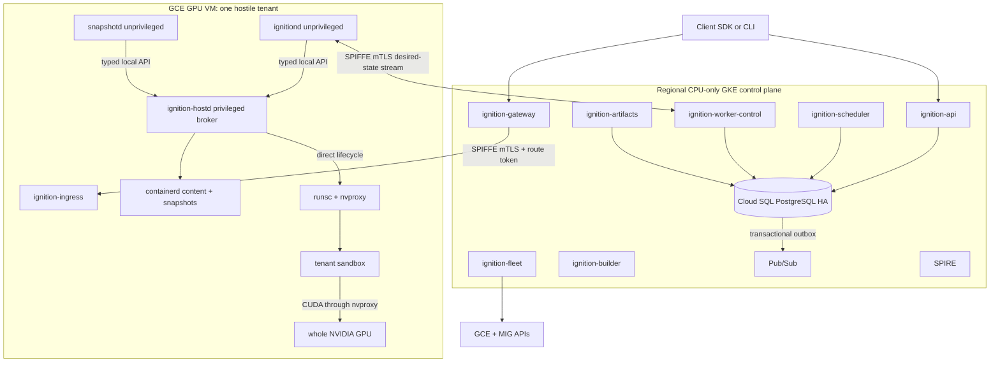

# Ignition deferred custom runtime

**Status: DEFERRED — none of this is built and none of it is on the deploy
path.** It is the design of record for a custom Compute Engine / MIG worker
runtime that would replace GKE-managed provisioning. It is built only on measured
evidence that GKE cannot meet a requirement — see
[the gate](#0-the-gate). The shipped system is in
[shipped architecture](ignition-shipped-architecture.md).

Not built: `ignition-scheduler`, `ignition-worker-control`, `ignition-fleet`,
`ignition-artifacts`, `ignition-builder`, `ignitiond`, `ignition-hostd`,
`snapshotd`, `ignition-ingress`, `ignition-gpu-health`, the GCE MIG worker fleet,
golden startup snapshots, and CUDA checkpoint/restore. The one role from this
document that **is** built is GPU attestation and node-reuse gating, realized as
`ignition-gpu-agent` on GKE (not `ignition-gpu-health`).

The public API, identity, data-plane, and storage contracts
([API contract](ignition-api-contract.md), [storage](ignition-shipped-architecture.md#10-storage))
are runtime-agnostic; a migration to this runtime must not change any public
contract.

## 0. The gate

Build this runtime only if measured evidence shows any of:

1. the 9s warm-capacity startup SLO or the cold-node target cannot be met after
   image-streaming and warm-pool tuning;
2. managed GKE Pod snapshots fail the measured startup / lifecycle /
   compatibility / isolation / storage requirements after qualification;
3. driver / `nvproxy` / CUDA tuple pinning stricter than GKE's validated versions
   is required for snapshot portability;
4. per-GPU lease fencing or lifecycle control beyond Kubernetes semantics is
   demonstrably necessary because of an isolation or billing defect.

[gVisor issue #12600](https://github.com/google/gvisor/issues/12600) (host-invoked
`cuda-checkpoint` failing on L4 under OSS `runsc`, open, no maintainer reply) is
the standing reason not to build the custom checkpoint chain now.

## 1. Architecture



### Control-plane services

| Service | Owns |
|---|---|
| `ignition-api` | public API, auth, admission, idempotency, operations, events (unchanged from shipped) |
| `ignition-scheduler` | queue claims + scheduling state (not queue insertion), placement, active GPU leases, desired worker assignment, compatibility matching |
| `ignition-worker-control` | worker registration, owner-epoch streams, commands, acknowledgements, observations |
| `ignition-gateway` | exec data plane (built; here it validates route tokens and proxies to `ignition-ingress`) |
| `ignition-fleet` | MIG target size (sole writer), warm-buffer policy, immutable templates, blue/green rollout, draining obsolete pools |
| `ignition-artifacts` | authoritative image + golden-artifact metadata |
| `ignition-builder` | image conversion + golden startup snapshot workflows |

### Worker services (one GPU VM, one hostile tenant)

- **`ignitiond`** — unprivileged desired-state coordinator and control-plane
  client. Never receives the containerd root socket or permission to invoke
  `runsc`; cannot use containerd task APIs.
- **`ignition-hostd`** — privileged typed broker and sole direct owner of `runsc
  create/start/checkpoint/fscheckpoint/restore/delete` and required containerd
  content/snapshot access. Typed operations only (`CreateSandboxResources`,
  `ConfigureGPUDevice`, `MountRootfs`, `ConfigureNetwork`, `Runsc*`,
  `ResolveContainerdContent`, `MountContainerdSnapshot`, `DestroySandboxResources`,
  `InspectResources`). Validates identifiers, canonical paths, ownership, resource
  ceilings, device UUID, lease token, allowed argv, allowed content/snapshot ops.
  Cannot access the public network, tenant secrets, arbitrary host paths, or
  arbitrary commands.
- **`snapshotd`** — unprivileged package / policy / encryption / transfer
  coordinator; requests typed checkpoint/restore from `ignition-hostd`.
- **`ignition-ingress`** — unprivileged route and exec-spool proxy.
- **`ignition-gpu-health`** — supervised DCGM/NVIDIA health adapter.

Each worker service has a dedicated Unix socket, user, filesystem area, and
systemd unit. containerd supplies content and lazy snapshot services only; the
initial lifecycle does not use the containerd task API or
`containerd-shim-runsc-v1` (disabled until released upstream support is
qualified).

### Regional infrastructure

At least three replicas of required stateless services across three GKE zones,
topology spread, PDBs, one-zone spare capacity. Cloud SQL regional HA, private
IP, supported connector, bounded per-service pools, backups, PITR, cross-region
recovery material. **SPIFFE/SPIRE** for internal identity + mTLS (`k8s_psat` on
GKE, `gcp_iit` on GCE); Google API credentials and SPIFFE identities are separate
and non-interchangeable; static SA keys prohibited. GPU workers have no public IP
and run in GCE MIGs partitioned by `(gcp_project, region, zone, machine_type,
provisioning_model, compatibility_tuple)` — never a customer identifier. GCE
autoscaling and proactive redistribution are disabled; `ignition-fleet` is the
sole MIG target-size writer.

## 2. Admission and scheduling

`ignition-api` performs authorization, validation, quota reservation,
idempotency, sandbox/operation creation, **queue insertion**, lifecycle event,
and outbox insertion in **one serializable transaction** (all rows or none;
retried whole on serialization/deadlock/failover). Rejected admission never
creates a GPU lease.

Data model adds, over the shipped set: `organizations`, `secrets`,
`dataset_mounts`, `workers`, `gpus`, `gpu_leases`, `snapshots`, `artifacts`,
`quota_ledger` (append-only), `sandbox_queue`, `scheduler_project_state`,
`lifecycle_events`, `outbox_events`, `outbox_delivery_attempts`, dedup rows,
route generations, and `usage_ledger`. A migration-only role owns tables; runtime
roles receive owner-specific DML grants only.

### Scheduler

Acts only on committed queue rows. It does not admit, reserve quota, provision
VMs, configure GPUs, or start containers.

**Placement filters** — a candidate worker must have: current heartbeat, state
`READY`, GPU health `HEALTHY`, no active local or database lease, compatible GPU
SKU, compatible runtime tuple for snapshot restore, permitted zone + provisioning
model, sufficient CPU/RAM/disk/network. **Score** (never weakens a hard filter):
ready-sandbox reuse → local golden snapshot → zonal-cache snapshot → cached image
chunks → on-demand capacity → lowest predicted startup → LRU device.

**Atomic lease** — after claiming a committed queue row, one Postgres
transaction: lock the queue row and candidate GPU rows `FOR UPDATE SKIP LOCKED`;
revalidate; insert the lease under a unique-GPU constraint; increment the GPU
fencing token; assign worker + lease to sandbox; mark the queue row assigned;
write desired-state / lifecycle / outbox events; commit. The scheduler role has
no insert grant on admission / idempotency / operation / quota tables.

**Queueing and fairness** — queue by project + priority class. Persist per-project
weight, deficit, virtual finish, and last-served sequence in
`scheduler_project_state` (restart cannot reset fairness). Each round, on Postgres
time: add `quantum × project_weight` to each eligible project's deficit; pick a
project with sufficient deficit by `(virtual_finish, last_served_sequence,
project_id)`; claim its head row by `(priority_rank, enqueue_time, queue_id)`;
subtract cost and persist in the same transaction. All ordering columns include
the unique IDs so replicas make the same logical choice and skip only rows locked
by another claimant. Aging can raise priority rank but never bypasses quota or
compatibility. Enforce max queue age and project queued-sandbox quota; return
retryable `CAPACITY_UNAVAILABLE` after the database-time deadline. Priority does
not preempt an active untrusted workload in the initial release.

### GPU lease lifecycle and the physical release barrier

```text
RESERVED → ACTIVATING → ACTIVE → RELEASING → RELEASED
RESERVED/ACTIVATING/ACTIVE → SUSPECT
SUSPECT → RELEASED only after VM recreation + replacement-worker validation
```

Each worker persists a local high-water fencing token per physical GPU and
accepts a command only when its token ≥ the high-water value; a higher token is
durably recorded before execution; a token at or below high-water cannot activate
a different lease.

**A database lease release alone never makes a GPU reusable.** Normal release
requires an acknowledgement from the current worker-control owner epoch and
fencing token proving: sandbox + child processes exited; `runsc` processes,
NVIDIA contexts, and device FDs are gone; device mappings, mounts, namespaces,
cgroups, scratch, and local allocation are cleaned; GPU + worker health checks
passed. Any missing acknowledgement, stream loss, token/epoch mismatch,
local/database disagreement, or ambiguous cleanup marks the lease and worker
`SUSPECT`: the GPU is **never** reused in place — `ignition-fleet` recreates the
VM, and only the replacement's clean registration, burn-in, and health validation
returns capacity.

### Desired-state protocol and owner epochs

Workers hold a bidirectional SPIFFE-mTLS gRPC stream to `ignition-worker-control`.
Worker messages: `RegisterWorker`, `Heartbeat`, `InventoryUpdate`,
`SandboxStatus`, `ProcessStatus`, `GPUHealthEvent`, `InterruptionEvent`. Control
messages: `DesiredSandbox`, `StopSandbox`, `DrainWorker`, `PrepareGoldenSnapshot`,
`RestoreGoldenSnapshot`, `RefreshCredentials`. Every command and acknowledgement
carries worker generation, desired-state generation, operation ID, GPU lease
fencing token, and worker-control owner epoch.

Worker-control replicas lease worker-stream ownership in Postgres; acquiring it
increments a durable monotonic **owner epoch**. A reconnect authenticates the
worker SPIFFE identity, verifies the expected GCE instance + compatibility tuple,
increments the stream generation, acquires a new epoch, invalidates the previous
connection, and sends the latest durable desired state. The worker accepts
exactly one command stream for its current epoch and rejects lower-epoch
commands/acks. Commands are idempotent.

## 3. Worker runtime and GPU isolation

**Reconciliation for a create:** validate generations / lease / fencing token /
tuple → atomically reserve the local GPU → resolve image + optional snapshot
metadata → construct server-owned OCI config → select the trusted CDI device →
create cgroup / namespace / rootfs / scratch / network → `ignition-hostd` invokes
the pinned `runsc` lifecycle directly → verify GPU visibility + readiness →
activate the ingress route → report observed state + timings. Deletion reverses;
route removal precedes process termination.

**Local state** journals under `/var/lib/ignition` (desired/observed generation,
lease + fencing token, runtime IDs, containerd references, mount/network/cgroup
IDs, snapshot op IDs, cleanup progress). On restart, inspect actual
kernel/containerd state before continuing — never assume the prior step
completed.

**OCI policy.** Tenant-controlled: immutable image digest, argv, bounded
non-secret env, declared work dir, CPU/RAM class, approved egress policy. Always
denied: privileged containers, host PID/IPC/user/network namespaces, host-path
mounts, arbitrary hooks or CDI records, arbitrary devices, added capabilities,
metadata-server access, writable rootfs unless policy permits.

**GPU + CDI.** Discover GPU UUID / PCI identity / SKU / driver / health. Generate
CDI records with a pinned `nvidia-ctk` from trusted boot-time code only; CDI
storage writable only by trusted services; uncontrolled refresh disabled; reject
a record not generated and admitted by the worker image; validate and hash every
hook / mount / env entry / device node and fail closed on drift. Select the whole
leased GPU **by UUID, not ordinal**; expose its validated CDI device set,
including `/dev/nvidia-uvm` when the admitted CUDA stack requires it. For
checkpointable workloads, prohibit managed-memory / UVM allocations by allowlist
policy and qualification tests — **not** by claiming the UVM node is hidden.
Reject IPC, NCCL, unvalidated capabilities, extra device nodes, unsupported
ioctls. Verify device identity from inside the sandbox before readiness.
`nvproxy` reduces host-kernel exposure but the host NVIDIA driver remains
trusted — do not claim VM-equivalent GPU isolation.

**gVisor.** One mutually untrusted tenant per `runsc` sandbox; one hostile tenant
+ one whole GPU per VM; multiple hostile tenants never share the host NVIDIA
driver on one worker. Host networking is unavailable for this tier.

**GPU health.** Boot admission: enumerate the expected device, validate the
tuple, check ECC / retired pages, run an allocation + short GEMM, report healthy.
Severe XID / DCGM events remove ingress, cordon the worker, stop placement,
terminate affected sandboxes, and quarantine the VM for replacement. No runtime
snapshot is attempted during GPU failure.

## 4. Fleet and VM lifecycle

**Worker image** — minimal Ubuntu 24.04 LTS baking the exact NVIDIA driver,
`runsc` + containerd content/snapshot services (no task API / shim), containerd,
the selected lazy snapshotter, `cuda-checkpoint`, DCGM, `ignitiond` /
`ignition-hostd` / `snapshotd` / `ignition-ingress`, a telemetry agent, and a
compatibility-tuple probe. Build with Packer/Cloud Build, verify
provenance/checksums, canary on a GPU, publish an immutable digest. Never upgrade
live workers in place.

**Worker lifecycle:** `PROVISIONING → BOOTING → REGISTERING → BURN_IN → READY →
DRAINING → TERMINATING`; any severe boot/tuple/driver/GPU/health failure →
`QUARANTINED` + VM replacement. MIG health checks only VM/process liveness;
scheduler readiness additionally requires registration, exact tuple, GPU burn-in,
time sync, storage access, and control-stream health.

**Warm capacity:** `desired = active + max(min_buffer, ceil(arrival_rate ×
p95_provision_seconds))`, clamped by quota / budget / max buffer / observed
stock; refilled asynchronously after placement. A snapshot does not replace warm
VM capacity (VM allocation + driver startup are outside sandbox restore).

**Scale-in** removes one concrete worker at a time — never a blind MIG target
decrement: select a specific idle worker by stable ID + managed-instance URL →
cordon it in Postgres + record a drain operation → wait for scheduler exclusion +
drain ack → locked read confirming no active/releasing/suspect lease → query the
worker under the current owner epoch confirming no local allocation and complete
cleanup → delete that exact managed instance and await confirmed deletion →
reconcile MIG target only after deletion, no automatic replacement. Any race /
ack mismatch / disagreement / health failure cancels ordinary scale-in, marks the
worker `SUSPECT`, and forces VM recreation before its GPU re-enters service.

**Spot:** overflow and cost optimization only, distinct reliability class, no
preemption-time recovery snapshot; fail or retry in-flight work and recreate from
the immutable golden snapshot. Correctness never depends on GCP's extended
preemption-notice preview. **Maintenance:** mark draining → stop placement →
drain → fail/retry work that can't finish by the deadline → recreate from golden
on a qualified worker → terminate before the deadline. **Rollout:** build the new
tuple → canary template + MIG → runtime/GPU/checkpoint qualification → internal
canary traffic → grow green → drain blue → retain rollback capacity → delete blue
only after soak. Never restore snapshots across tuple generations without
explicit certification.

## 5. Checkpoint and restore

**Snapshot classes:** golden startup (initial production — immutable, request-free
filesystem/process/GPU artifact for allowlisted stateless inference, built by
`ignition-builder`); session, recovery, and filesystem-only are all **deferred**
and not public. Spot / host failure recreate from the immutable golden snapshot;
in-flight requests may fail. No periodic runtime-recovery checkpoint.

**Canonical golden identity:** `project + image digest + startup policy
revision`. Compatibility additionally pins snapshot key, GPU SKU, the complete
compatibility tuple (host image, kernel, CPU feature policy, exact NVIDIA driver,
GPU SKU + observable firmware identity, exact `runsc`, containerd
content/snapshot versions, CUDA userspace, workload runtime, exact
`cuda-checkpoint` digest + in-container path), lifecycle contract version, and
filesystem layout. Changing any input creates a new immutable artifact. The
builder injects the pinned `cuda-checkpoint` binary read-only inside the sandbox
and rejects a missing / writable / differently hashed / image-selected binary.

**Filesystem checkpoint contract:** before process or GPU checkpoint,
`ignition-hostd` runs gVisor `fscheckpoint` for the rootfs writable upper (on
disk-backed overlay2) and every declared disk-backed tmpfs admitted as required
startup state. User-created tmpfs, user-created mounts, and ephemeral scratch are
excluded and cannot hold required startup state; build-time probes fail closed if
restore depends on excluded state. **Filesystem restore completes before
process/GPU restore begins.**

**Manifest:** one entry for every file under each opaque `runsc` checkpoint and
`fscheckpoint` directory — directory kind, normalized relative path, mode, size,
digest, `required` flag — plus schema/class, project/artifact/image/startup IDs,
compatibility tuple + CPU-feature hash + pinned `cuda-checkpoint` digest/path,
sequence + timestamps, lifecycle-contract version, encryption algorithm + KMS key
version, retention/authorization policy. Authenticated independently of GCS IAM.
Directory traversal, duplicate/absolute paths, unsupported types, unexpected
required files, mode/size/digest mismatch, and missing required files fail
closed. **No package models only `pages.img`.**

**Create sequence:** validate authorization/lease/tuple/deadline → remove the
ingress route + drain requests → verify the workload is allowlisted and has no
active requests → `prepare_snapshot` → validate the overlay2 upper + declared
tmpfs set → `fscheckpoint`, wait for durable completion → integrated process/GPU
checkpoint with the pinned in-sandbox binary → recursively manifest → hash +
envelope-encrypt → upload to a temp prefix → upload the authenticated manifest →
commit catalog state atomically → terminate/quarantine the build sandbox by
result.

**Restore sequence:** authorize → verify manifest signature + schema → verify
image / tuple / GPU SKU / CPU features / lifecycle contract → reserve RAM/disk/GPU
→ download + decrypt into a protected dir → verify every manifested path/mode/
size/digest/required flag → restore the rootfs upper + declared tmpfs from
`fscheckpoint` → after filesystem completion, process/GPU runtime restore → wait
for asynchronous gVisor background restore to finish and release all references →
`after_restore` → verify exact GPU visibility + application health → activate
ingress → securely remove temporary plaintext. **No silent compatibility
fallback.** Decrypted files are retained until asynchronous restore completes —
early deletion is a correctness failure.

**Cross-host qualification gate** — publication requires repeated restores onto a
different worker with a distinct physical GPU: persistence mode + `cuInit`
ordering, source→target GPU UUID/PCI remapping without ordinal assumptions, exact
visible-device identity, NVML enumeration, PyTorch allocation/kernels/
synchronization/numerics, CUDA graph replay, model-server readiness + inference
correctness + concurrency + hooks. Same-host or same-physical-GPU tests are
insufficient.

**Encryption:** unique DEK per snapshot, authenticated encryption, wrapped by a
project/domain KMS key; plaintext only on the authorized worker; object-read and
KMS-decrypt permissions separate; wrapping-key rotation without rewriting
plaintext.

**Snapshot lifecycle contract** (managed workload trigger): `prepare_snapshot`,
`after_restore`, `health`, `drain`, `abort` — strict deadlines, structured
results. Generic image delivery never invokes them. Failure to qualify a snapshot
falls back to the admitted image delivery strategy for future launches; it never
makes the image unrunnable.

## 6. Data plane (exec spool)

`ignition-ingress` owns a bounded per-process Local-SSD spool keyed by sandbox,
generation, process, stream epoch. Binary frames carry channel, kind, half-open
byte ranges, cumulative acknowledgements, control data, and explicit `TRUNCATED`
/ `GAP` outcomes. Output reconnect uses acknowledged offsets; unknown stdin
acknowledgement is never automatically replayed. Process lifetime is independent
of client/gateway attachment. Reconnect window: 10 minutes after process exit.

Postgres routes are generation-scoped; `ignition-worker-control` is the sole
route-state writer. Gateways may cache outbox updates but validate the current
`READY` generation before opening a backend. Route tokens bind project, sandbox,
generation, ingress epoch, action, protocol, and destination identity; clients
never select worker IPs or ports.

*(The shipped GKE exec path replaces all of this with `ignition-gateway`
proxying a WebSocket to `sandbox-init` and an in-memory replay buffer — see
[shipped architecture §8](ignition-shipped-architecture.md#8-exec-data-plane).)*

## 7. Events and outbox

Write each resource mutation, lifecycle event, and outbox event in one
transaction; every event gets an immutable UUID at insertion. Dispatchers claim
committed rows `FOR UPDATE SKIP LOCKED` with a database-time lease, publish with
the event ID as the message ID, and mark published only after broker
acknowledgement. Expired claims retry with bounded backoff; after the attempt
limit the event moves to a DLQ preserving event ID + payload + attempt history.
Authorized replay creates a new delivery attempt for the same immutable event ID
and is audited. Each consumer stores the event ID in its own dedup table in the
same transaction as the event's effects — a duplicate commits neither duplicate
effects nor a second dedup row. Delivery is at-least-once; Pub/Sub ordering is
not a correctness mechanism.

## 8. Interruption behavior

Spot / host failure: cordon when possible, invalidate routes, recreate from the
immutable golden startup artifact, retry or fail in-flight work under the public
request contract. Planned maintenance: stop placement + commit route draining,
drain bounded active work, recreate on a qualified replacement, terminate before
the deadline. No flow creates a runtime recovery memory snapshot. Extended Spot
notice can improve drain opportunity but is never a durability/correctness
dependency.

## 9. Milestone plan (not executed)

| Milestone | Deliver | Gate |
|---|---|---|
| **0 — Freeze specs** | authoritative module contracts (identity, ownership, tuple, manifest, state, physical release, scope); canonical protobuf/OpenAPI, DB ownership, authz matrix, route/frame schemas, measurement methods | every production-blocking decision is normative or explicitly deferred; module docs consistent |
| **1 — Runtime + checkpoint qualification** | `nvproxy` + direct `ignition-hostd` `runsc` lifecycle on G2/L4; same-tuple cross-host filesystem/process/GPU golden restore on distinct physical GPUs; reproducible cold / local-cache / application-ready / first-token measurements | no unsupported required CUDA behavior, nondeterministic restore, lifecycle ambiguity, or isolation failure |
| **2 — Secure worker services** | unprivileged `ignitiond` / `snapshotd` / ingress / GPU-health, privileged typed `ignition-hostd`; containerd content/lazy-snapshot integration without task API or shim; trusted OCI/CDI policy, exact binary injection, golden ordering, cleanup journals, physical-release acknowledgement | 1,000 lifecycle iterations, restart-at-every-step convergence, adversarial isolation tests pass; ambiguity recreates the VM |
| **3 — Durable control plane** | separate API/scheduler/worker-control/gateway/fleet/artifacts/builder on regional GKE; Cloud SQL HA schemas + least-privilege roles; atomic admission, persistent fairness, leases/fencing, owner epochs, operations, outbox/DLQ/dedup, route generations, metering; OIDC/IAP + SPIRE/WIF identity separation | concurrency, duplicate request, stale epoch/token, service restart, outbox crash/replay, Cloud SQL failover tests pass; grants prevent cross-owner writes; no static SA keys |
| **4 — Client + data plane** | REST/gRPC contracts, Python/TS SDKs, `ignitionctl`; exec spool/offset protocol; default-deny egress; prove no writable Volume / public Session snapshot in public schemas | one black-box conformance suite passes REST + SDK + CLI; attach, reconnect, truncation/gap, path-isolation tests pass |
| **5 — Images, golden startup, fleet** | immutable image admission + benchmark GKE streaming vs cached vs eager; if the gate is met, qualify Nydus/eStargz/SOCI/eager overlayfs; builder/catalog atomic publication + differential verification + complete snapshot manifests; immutable worker images + blue/green tuple rolls; warm pools + deterministic instance-specific scale-in | second-worker restore, local-cache/cold targets, cache loss, tuple rollback, MIG race tests pass |
| **6 — Production launch** | adversarial gVisor/GPU isolation + credential-boundary tests; zone loss, Cloud SQL failover, regional restore, Pub/Sub redelivery, ingress/gateway replacement, worker loss, Spot, maintenance drills; backup/PITR, KMS + signing-key rotation, SBOM/provenance/scanning, sustained + burst load, metering reconciliation, cost tests; canary + seven-day soak | every module acceptance test + launch target passes; dashboards, alerts, error-budget policy, runbooks, on-call, rollback complete; no known isolation defect |

## 10. Launch-target SLOs

Targets for a production launch, not measured guarantees; several depend on
components not built. Scoped to the validated workload / GPU SKU / capture size /
cache state / strategy — they do not generalize.

| Target | Value |
|---|---|
| public API availability | 99.9% monthly |
| gateway request availability | 99.9% monthly |
| scheduler decision latency (queue claim → committed lease/assignment) | p95 ≤ 100 ms at launch load |
| exec attach (authenticated gateway receipt → attachment ack, `READY` sandbox) | p95 ≤ 1 s |
| golden restore, ≤ 8 GiB captured VRAM, locally cached artifact | p95 application-ready ≤ 20 s |
| cold lazy image, validated L4 workload | p95 application-ready ≤ 120 s |
| Cloud SQL zonal failover | RPO 0, RTO 5 min |
| regional DR from cross-region backup/PITR | RPO 15 min, RTO 4 hours |

## 11. Remaining decisions

Resolved: customer identity hierarchy, external authentication, service-account
OAuth, writable-Volume exclusion, public-Session exclusion, runtime-recovery
exclusion, production service split, direct `ignition-hostd` lifecycle ownership,
Spot-preview independence.

Open (must become versioned policy before the corresponding gate): allowlisted
model servers / models / CUDA APIs / versions; initial OCI registry product; GKE
cache-cohort policy and (only if the gate trips) the qualified lazy-image
backend; project queue deadlines + interrupted-request retry policy; maximum
captured VRAM / artifact size beyond the launch class; golden retention /
invalidation windows; per-pool budget + minimum warm capacity; maximum retained
exec output within the fixed reconnect protocol; initial regions / GPU SKUs /
capacity fallbacks.

No remaining decision can weaken project scoping, one-hostile-tenant-per-VM
isolation, the physical release barrier, immutable golden-only recovery, or a
production gate.
