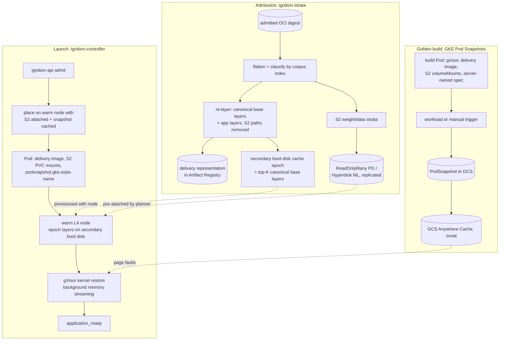

# Ignition Fast Startup on GCP: Stratified Delivery and Managed Pod Snapshots

**Status:** Proposed — nothing here is built. A class-specific accelerator layered
on [Images and Startup Acceleration](ignition-design-images-startup.md) and
[Image Data Layer](ignition-design-image-datalayer.md); it reuses their
admission, catalog, stage definitions, strategy selection, and the managed GKE
Pod snapshot path, and adds two things they do not cover: moving large
read-only data out of the image onto block storage, and planning node-level data
locality.

**Parent:** [Ignition Technical Design](ignition-technical-design.md)
**Runtime:** [GKE Sandbox](ignition-design-gke-sandbox.md)
**Snapshot path:** [Images and Startup Acceleration — Managed GKE snapshot path](ignition-design-images-startup.md#managed-gke-snapshot-path)

## Problem

Startup for large ML containers is slow for a structural reason. The image
couples three things with very different sizes, change rates, and sharing
patterns — base OS/CUDA/framework (~8 GB, shared by many images), application
(~1 GB, per image), and model weights (tens of GB, often shared across a
customer's images) — and every delivery mechanism has to move that coupled blob
before the process can begin the *second* slow phase: importing the framework,
creating a CUDA context, and loading weights into VRAM.

Lazy delivery (GKE image streaming, eStargz, SOCI, Nydus) fixes `rootfs_ready`.
It does not fix the time after `container_started`, because the loader still
touches all the weight bytes, now serialised behind its own access pattern and
small-range fetches. The sibling designs are correct that `application_ready`
cannot be made independent of image size for an arbitrary program, and that no
new filesystem is justified.

This design keeps both principles and targets the class Ignition actually
serves — allowlisted inference. It separates the image into strata delivered by
different GCP block-storage mechanisms, and separates the process phase by
restoring a pre-warmed Pod instead of re-running initialisation. Arbitrary OCI
images stay correct on the unchanged generic path.

## Summary

1. **Stratified delivery (`ignition-strata`, new).** At admission, classify
   each image's files by corpus-wide content into shared base, per-image
   application, and weight/data strata, then:
   - **re-layer** the image so shared base content lands in canonical,
     byte-identical layers across images — the same flattened tree, different
     layer boundaries — so GKE image streaming's layer cache and
     `CONTAINER_IMAGE_CACHE` secondary boot-disk epochs hit on content, not on
     how the customer wrote their Dockerfile;
   - publish weight/data strata as **ReadOnlyMany Persistent Disks** (pd-ssd,
     up to 100 read-only attachments per disk; Hyperdisk ML, up to 2,500, on
     A3-class pools), mounted read-only into the Pod at the original paths by
     the server-owned Pod spec — the image the sandbox pulls no longer contains
     them.
   No FUSE daemon, no custom snapshotter, no supervisor injection, PID 1
   unchanged.

2. **Golden snapshots on GKE Pod Snapshots.** The sibling design already
   specifies the managed path. This document adds the composition-aware build
   spec (so the distilled Pod spec hash matches), VRAM-based tiering, a zonal
   cache, host-side prefetch, and generation-aware invalidation. GKE Pod
   Snapshots is **GA as of May 6, 2026 on GKE ≥ 1.35.3-gke.1234000**; the
   "Preview" caveat in the sibling design is stale and should be removed, though
   Ignition's own qualification gate stands.

3. **Data-locality-aware warm pool.** The warm-node buffer in the GKE Sandbox
   design gains an attachment plan (which weight disks sit on which warm nodes),
   a cache-warming job (which snapshots are hot in the zonal cache), and a
   placement affinity so a launch lands where its data already is.

What is new is content-defined stratification realised on block storage rather
than a content-addressed filesystem, and the composition of re-layering,
secondary boot disks, multi-attach read-only disks, Pod Snapshots, and a planner
into one startup path. No filesystem, snapshotter, or checkpoint engine is built.

## Targets

Qualification targets for snapshot-qualified inference images on the L4 pool,
not general SLOs. The generic objectives in
[Images and Startup Acceleration — Service objectives](ignition-design-images-startup.md#service-objectives)
are unchanged.

| Measurement | Today | Target |
|---|---|---|
| p95 `request_admitted → runtime_ready`, warm node | ≤ 9 s | ≤ 9 s |
| p95 `request_admitted → application_ready`, warm node, snapshot-qualified, zonal cache hot, ≤ 8 GiB captured VRAM | unbounded (cold load) | **≤ 9 s** |
| same, zonal cache cold | unbounded | ≤ 30 s |
| p95 `rootfs_ready` for a 60 GB image on a node that has never seen it, weight stratum pre-attached | bounded by image size | bounded by the non-cached layers (≤ 2 GB) |

## Architecture



## Stratification (`ignition-strata`)

Runs inside admission
([Image Data Layer — Image admission and catalog](ignition-design-image-datalayer.md#image-admission-and-catalog)),
after signature, provenance, and policy verification. It produces a **delivery
representation** and a **composition record** on the catalog entry. It is one
of the "alternative representations" the sibling design already allows, and it
must pass the same differential verifier: the flattened tree and the OCI
execution configuration are unchanged except for the S2 path removal recorded in
the composition record. The generic path ignores the record.

### Classification

1. Flatten the admitted image and compute the canonical filesystem semantic
   digest the sibling design requires; per-file `sha256` is a by-product.
2. Look each file digest up in the **corpus index** (all admitted images in the
   region) and assign a stratum:
   - **S0 base** — digest is in the current *base catalog*: the top-K most
     shared file sets across the corpus (OS packages, CUDA, cuDNN, NCCL,
     framework wheels), recomputed on a cadence. Membership is by content, so
     two customers' different Dockerfiles that install the same PyTorch wheel
     share S0.
   - **S2 weight/data** — file above a size threshold (default 256 MiB), under
     a declared data path, matching a weight-format signature
     (safetensors/GGUF/`.bin`/`.pt`), or whose digest matches an already
     published S2 stratum.
   - **S1 application** — everything else. Target ≤ 2 GB; admission surfaces
     what pushed it above 4 GB.

### Corpus index: `nydus-image` as the analyzer

The corpus index does not need a new chunker. `ignition-strata` runs
`nydus-image create` (Nydus RAFS v6) over each admitted image's layers at
admission, purely as an offline analyzer: it yields content-addressed chunk
digests, per-file chunk lists, and cross-image chunk-level dedup statistics
without deploying `nydusd`, a snapshotter, or any node-side component. The
classifier consumes those statistics to choose S0 sets (chunk sets shared by
many images) and to detect S2 candidates that already exist in another image.

Two consequences:

- the sharing measurements in the rollout come from a mature, already-qualified
  tool rather than a bespoke chunker;
- the same run can emit a RAFS v6 representation for free, so if the custom GCE
  gate ever trips, Nydus — the first candidate in
  [Image Data Layer — Backend qualification order](ignition-design-image-datalayer.md#backend-qualification-order)
  — has its inputs already in the catalog.

Nydus is **not** used at runtime on the shipped GKE path: GKE owns containerd on
managed nodes, GKE Sandbox requires `cos_containerd`, and gVisor is not among
Nydus's supported runtimes. Image streaming and secondary boot disks remain the
S0/S1 delivery path on GKE.

### Re-layering (S0 + S1)

The delivery representation is a new OCI manifest over the *same* flattened
tree with **canonical layer boundaries**:

- one layer per base-catalog set, built deterministically (sorted paths,
  normalised timestamps and ownership) so the layer digest is identical for
  every image that contains that set;
- application layers after them, in a deterministic order;
- S2 paths replaced by empty mount-point directories with the original mode.

Because the base layers are byte-identical across images, GKE image streaming
serves them from its cache after the first image, and a `CONTAINER_IMAGE_CACHE`
secondary boot-disk epoch built from the base catalog hits on every image that
shares those sets — regardless of the customer's original layering. This is what
turns the sibling design's "curated cache cohort" into a content-derived one.
GKE's plugin reads preloaded layers from the secondary boot disk and pulls the
remaining small upper layers from the registry, which is exactly the
base/app split.

The re-layered manifest is stored as an alternative representation. `Entrypoint`,
`Cmd`, `Env`, `WorkingDir`, `User`, and signal behaviour are untouched; the
source process is PID 1. No supervisor or binary is injected, consistent with
the sibling design's runtime-compatibility requirement.

### Weight and data strata (S2)

- Each S2 stratum becomes an ext4 read-only Persistent Disk built from the
  stratum files, snapshotted, and materialised as `N` replica disks per zone.
  Keyed by the stratum's content digest, so images sharing weights share the
  disk family. Replica count follows expected concurrent readers: pd-ssd allows
  100 read-only attachments per disk, pd-balanced 10. On A3-class pools one
  Hyperdisk ML volume replaces the replica set (up to 2,500 readers, 1.2 TiB/s
  aggregate). Hyperdisk ML is not available on G2.
- The server-owned Pod spec declares a `ReadOnlyMany` PVC `volumeMount` with
  `readOnly: true` at each S2 path named in the composition record. GKE Sandbox
  supports the PD CSI driver; `volumeDevices` (raw block) is not supported and
  is not used. Nothing tenant-supplied selects a path or a volume.
- Weights are never inside the delivery image and never in a Pod Snapshot as
  file data (persistent volumes are not checkpointed); the disk family is the
  single durable copy.

This is the one place this document extends a sibling non-goal: the data layer
"does not deliver application datasets". Here, admitted read-only data
discovered *inside* the image is delivered as a platform-owned volume. Writable
Volumes and customer-managed datasets remain out of scope.

### Fallbacks

- S0 not in the current epoch: those layers stream from the registry. Correct,
  slower, measured.
- No S2: the composition record is trivial; the representation is just
  re-layered.
- Required S2 not attached to any warm node: the launch pays a GKE PD attach
  (tens of seconds, serialised per node), recorded as `strata_attach_seconds`,
  outside the fast-path target.
- Replica set at its reader limit: the planner requests another replica; the
  launch queues, or uses the source representation if the image was admitted
  with that option.

## Golden snapshots on GKE Pod Snapshots

The managed path — CRDs, storage config, `federatedP4SA` path-scoped tokens,
workload vs manual trigger, second-node verification, identity/secret refresh,
and cold-fallback reporting — is specified in
[Images and Startup Acceleration — Managed GKE snapshot path](ignition-design-images-startup.md#managed-gke-snapshot-path)
and is not repeated here. This section adds what a stratified image needs.

### Status correction

The sibling design describes GKE Pod Snapshots as Preview. Google's GKE release
notes record: "GKE Pod Snapshots is generally available on clusters that run
version 1.35.3-gke.1234000 or later" (May 6, 2026). Ignition's own qualification
gate — cross-node restore, correctness, isolation, and storage tests — still
applies, but the feature is no longer a pre-GA dependency. Separately,
[gVisor issue #12600](https://github.com/google/gvisor/issues/12600) (OSS `runsc`
20260126, driver 580.105.08, L4, host-invoked `cuda-checkpoint` failing with
`CUDA_ERROR_OPERATING_SYSTEM`, open, no maintainer reply) remains the right
reason not to build the custom-runtime chain; it does not describe the managed
mechanism.

### Composition-aware build

GKE matches snapshots by a **distilled Pod spec hash** (image, command, args,
volume mounts, security context). The build Pod must therefore use the same
delivery representation digest, the same S2 `volumeMounts`, and the same
server-owned security context the controller generates for a customer sandbox.
`ignition-builder` derives both from the composition record; a drift between
build and launch specs is a build failure, not a silent cold start.

The catalog records, in addition to the sibling design's fields,
`captured_vram_bytes` and the gVisor kernel and NVIDIA driver versions of the
producing node-pool generation.

### Restore additions

- **Zonal cache.** The snapshot bucket has GCS Anywhere Cache enabled per
  sandbox zone; the planner keeps the top-K artifacts warm.
- **Host-side prefetch.** gVisor accepts and ignores `fadvise`, and GKE image
  streaming exposes no prefetch API. Neither applies to the S2 disks or to the
  node-local snapshot cache, which are ordinary host files. `ignition-gpu-agent`
  (already privileged, one per node) gains a prefetch role: on Pod admission it
  reads the artifact's access profile (recorded at verification, in the sibling
  design's profile format) and issues host `readahead` against S2 files and
  cached snapshot ranges before the sentry starts faulting. This is the one place
  a profile can drive prefetch on the shipped GKE path; demand faults still take
  priority.

### Size and tiering

A snapshot is roughly CPU RSS plus captured VRAM (GKE's worked example: a
100 GB model yields a ~200 GB snapshot). Weights on S2 are file-backed and not
duplicated in the snapshot; the VRAM copy is. `captured_vram_bytes` selects a
tier:

| Captured VRAM | Zonal cache hot | Zonal cache cold |
|---|---|---|
| ≤ 8 GiB | ≤ 9 s | ≤ 30 s |
| 8–16 GiB | ≤ 15 s | ≤ 60 s |
| > 16 GiB | explicit slow tier; evaluate the CPU-snapshot strategy below |

The sibling design's strategy selection gains one candidate: a snapshot taken
*before* weights reach VRAM (imports, JIT, CUDA graphs captured; weights read
from S2 after restore). For large models the S2 read path can beat the snapshot
page-fault path.

### Invalidation

In addition to the sibling triggers, an artifact is invalidated when the node
pool's gVisor kernel or NVIDIA driver version changes — GKE requires an exact
match for GPU snapshots. Node-pool generation roll-over schedules a rebuild of
every affected artifact before the old generation drains; the controller never
restores onto a mismatched generation.

## Warm-pool planner

Extends the warm-capacity controller in
[GKE Sandbox](ignition-design-gke-sandbox.md#warm-capacity-mechanism):

1. **Attachment plan.** Per `(zone, generation)`, keep the S2 strata of the
   top-K images (trailing launch rate × stratum size) attached to warm nodes,
   within 128 disks per node and the per-disk reader limit; request replicas
   when the limit binds.
2. **Cache warming.** Keep the top-K golden snapshots hot in Anywhere Cache;
   pre-place their access profiles on nodes.
3. **Placement affinity.** Maintain `strata_ready` / `snapshot_ready` node
   labels; `ignition-controller` prefers both, then strata-only, then any warm
   node. Balloon-Pod preemption is unchanged.

## Startup budget (warm, affine node; hot cache; snapshot-qualified)

```text
request_admitted → committed                      ≤ 0.5 s
controller pickup, artifact match, Pod creation   ≤ 1.0 s
scheduling onto affine warm node (preempt)        ≤ 1.5 s
non-cached layers streamed (≤ 2 GB)               ≤ 1.0 s  (overlaps below)
epoch layers on secondary boot disk, S2 attached  ≈ 0 s
gVisor kernel restore                             ≤ 3.0 s
resume; host prefetch + page faults → first inference ≤ 2.0 s
-------------------------------------------------------------
p95 application_ready                             ≤ 9.0 s
```

Every stage is recorded under the sibling design's stage names and attributed
independently.

## New software

| Component | Role |
|---|---|
| `ignition-strata` | corpus index, classification, deterministic re-layering, S2 disk publishing, base-catalog → cache-epoch build, composition record |
| `ignition-builder` | composition-aware build spec; otherwise the sibling design's managed snapshot orchestration |
| `ignition-controller` | S2 volume wiring from the composition record, artifact match, generation-aware placement |
| warm-pool planner | attachment plan, cache warming, affinity labels |
| `ignition-gpu-agent` | host-side `readahead` from access profiles |

Not built: any filesystem, snapshotter, CAS, supervisor injection, `snapshotd`,
`ignition-hostd`, direct `runsc` lifecycle, or `cuda-checkpoint` injection.

## Relationship to existing designs

- **[GKE Sandbox — gate 2](ignition-design-gke-sandbox.md#relationship-to-the-custom-runtime)**
  now reads "managed GKE Pod snapshots fail … after qualification"; this
  document is the qualification plan for the stratified class.
- **[Images and Startup Acceleration](ignition-design-images-startup.md)** —
  unchanged in principle; this document adds a class-specific accelerator, fixes
  the Preview status, and supplies the composition-aware build spec. The
  "Persistent volumes, application datasets" scope exclusion is narrowed only
  for admitted read-only data found inside the image.
- **[Image Data Layer](ignition-design-image-datalayer.md)** — its decision not
  to build a filesystem is reinforced; re-layering is an alternative
  representation under its existing differential verifier, and S2 is delivered
  by block storage the platform already provides.
- **[Checkpoint and Restore](ignition-design-checkpoint-restore.md)** — remains
  the GCE-only design of record.

## Feasibility

Verified from product documentation:

- GKE Pod Snapshots: GA (May 6, 2026; GKE ≥ 1.35.3-gke.1234000); requires GKE
  Sandbox; supported on `g2-standard-4…96`, `a2-highgpu-1g`, `a2-ultragpu-1g`,
  `a3-highgpu-1g`; single-GPU Pods; MIG unsupported; stored in GCS; captures
  memory, rootfs delta, `emptyDir`, `tmpfs`, loopback/listening/Unix sockets,
  GPU via `cuda-checkpoint`; persistent volumes not checkpointed; external
  connections not restored; background memory streaming; `whole-pod` and
  `rootfs-only` scopes; `workload` and `manual` triggers; `postCheckpoint:
  stop|resume`; distilled-spec matching; gVisor kernel and driver versions must
  match.
- GKE secondary boot disks: PD per node from a disk image, provisioned in
  parallel with the node; containerd plugin reads preloaded layers, small upper
  layers pulled from the registry; requires image streaming; immutable per node
  pool.
- ReadOnlyMany PD on GKE: pre-populated disk, `readOnly: true`, same zone;
  pd-ssd ≤ 100 readers, pd-balanced ≤ 10; no read penalty for multi-attach; GKE
  Sandbox supports the PD CSI driver, not `volumeDevices`.
- Hyperdisk ML: not on G2; A3/A2/C3/N4-class; ≤ 2,500 readers at ≤ 512 GiB;
  100 attachments per 30 s.
- 128 disks per VM on `g2-standard-8`; Local SSD optional.
- gVisor: `pivot_root`, `chroot`, `mount`, `readahead` supported; `fadvise`
  ignored.

To be measured before commitment, in this order:

1. **Pod Snapshot on Ignition's tuple**: build/restore a representative vLLM
   image on the L4 pool with weights on a ROX pd-ssd; confirm GPU state restores
   and inference probes pass. Go/no-go for the snapshot half.
2. GKE image streaming and secondary boot disks on a **GKE Sandbox** node pool
   (documentation is silent; `gcloud` accepts both flags together).
3. Pod Snapshot semantics for file-backed `mmap` of a ReadOnlyMany PD: confirm
   mappings re-establish on restore and pages are re-read from the disk.
4. Re-layering hit rate: fraction of corpus bytes landing in canonical base
   layers, and secondary boot-disk hit rate per launch.
5. Restore throughput per L4 node from GCS with and without Anywhere Cache;
   fault-stall distribution in the first 30 s.
6. GKE PD attach latency and serialisation on sandbox nodes.
7. Host-side `readahead` from `ignition-gpu-agent` measurably reducing stalls.
8. Snapshot invalidation cost on node-pool upgrade at fleet scale.

## Acceptance

1. A snapshot-qualified image with ≤ 8 GiB captured VRAM reaches
   `application_ready` in p95 ≤ 9 s on a warm, affine node with a hot zonal
   cache, over 100 launches; ≤ 30 s with a cold cache.
2. A 60 GB image whose bulk is S0 + S2 reaches `rootfs_ready` on a node that has
   never seen it with only non-cached layers transferred; `runtime_ready` p95 ≤
   20 s with S2 pre-attached.
3. Two images sharing base content produce byte-identical canonical base layer
   digests; two images sharing a weight stratum publish one S2 disk family.
4. The differential verifier proves the re-layered representation's flattened
   tree and OCI execution configuration equal the source, except for the
   recorded S2 path removals; the source process is PID 1.
5. Artifacts are never restored onto a generation with a different gVisor or
   driver version; roll-over rebuilds all affected artifacts before drain.
6. From inside a sandbox, S2 mounts are read-only and there is no path to the
   secondary boot disk, other tenants' disks, the snapshot bucket, or the CSI
   driver.
7. Snapshot failure at any stage falls back to the generic path on a fresh
   sandbox and marks the artifact unhealthy; no image becomes unrunnable.
8. The Preview caveat in the sibling design is replaced by the GA citation and
   Ignition's own qualification gate.

## Rollout

1. **Spike (2–3 weeks, one L4 pool):** Pod Snapshot build/restore of a
   representative vLLM image with weights on a ROX pd-ssd; measure the restore
   timeline, fault stalls, and snapshot size; settle feasibility items 1–3.
2. **Strata v0:** `nydus-image` analysis over the admitted corpus, the corpus
   index, classification, and S2 disk publishing only; images still pulled
   whole; measure chunk-level sharing and attach behaviour on real customer
   images.
3. **Re-layering** as an alternative representation under the differential
   verifier; cold-start comparison against the source representation.
4. **Content-derived cache epochs** on a new pool generation; roll-over
   procedure.
5. **Composition-aware builder;** controller artifact match.
6. **Planner:** attachment plan, Anywhere Cache warming, affinity.
7. **Host-side prefetch** in `ignition-gpu-agent`.

## Upstream references

- [GKE release notes — Pod Snapshots GA](https://docs.cloud.google.com/kubernetes-engine/docs/release-notes-new-features)
- [GKE Pod snapshots — concepts](https://docs.cloud.google.com/kubernetes-engine/docs/concepts/pod-snapshots)
- [GKE Pod snapshot CRDs](https://docs.cloud.google.com/kubernetes-engine/docs/reference/crds/podsnapshot)
- [GKE Agent Sandbox](https://docs.cloud.google.com/kubernetes-engine/docs/concepts/machine-learning/agent-sandbox)
- [GKE secondary boot disks](https://docs.cloud.google.com/kubernetes-engine/docs/how-to/data-container-image-preloading)
- [GKE ReadOnlyMany persistent disks](https://docs.cloud.google.com/kubernetes-engine/docs/how-to/persistent-volumes/readonlymany-disks)
- [Compute Engine — share disks between instances](https://docs.cloud.google.com/compute/docs/disks/sharing-disks-between-vms)
- [Hyperdisk ML](https://docs.cloud.google.com/compute/docs/disks/hd-types/hyperdisk-ml)
- [GKE Sandbox](https://docs.cloud.google.com/kubernetes-engine/docs/concepts/sandbox-pods)
- [Nydus](https://github.com/dragonflyoss/nydus) — `nydus-image` used as an offline chunk/dedup analyzer only
- [gVisor issue #12600](https://github.com/google/gvisor/issues/12600)
