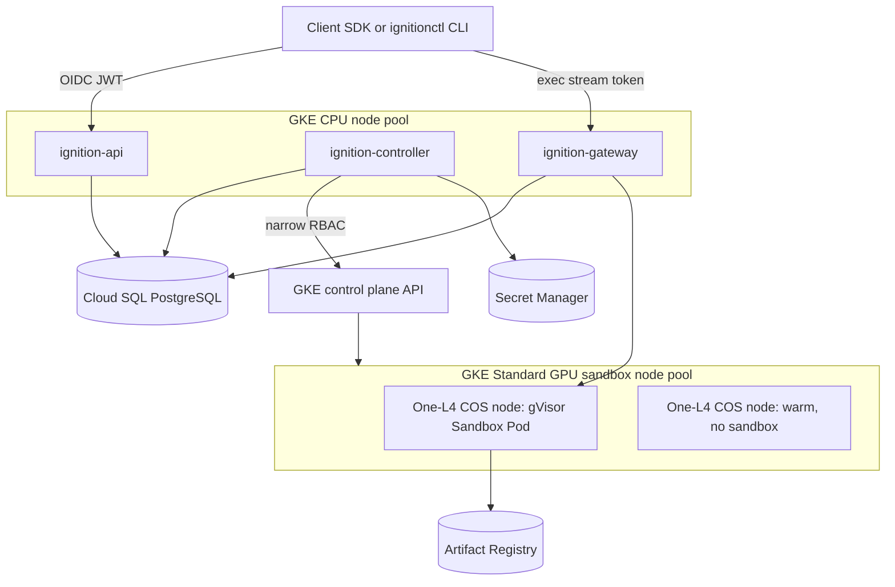
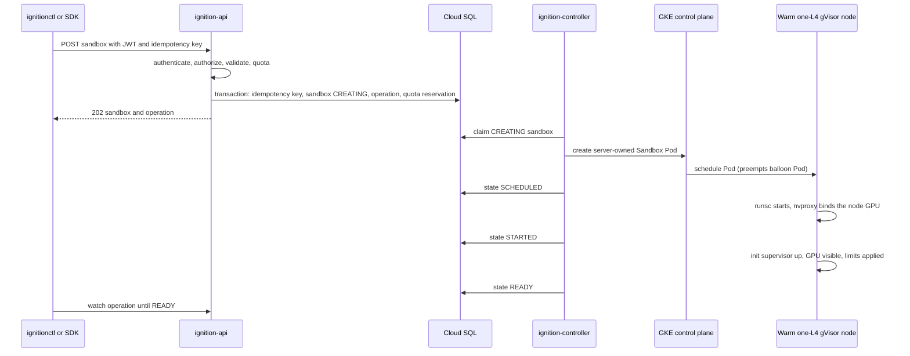

# Ignition GKE Sandbox MVP Design

**Status:** Draft v0.1 — recommended MVP architecture
**Parent:** [Ignition Technical Design](ignition-technical-design.md)
**Public API contract:** [Create Sandbox API Specification](ignition-sandbox-create-api.md)  
**Protos:** [`api/proto/ignition/v1/`](../../api/proto/ignition/v1/)  
**Build and deploy:** [Implementation guide](../guides/ignition-implementation.md)  

**API/controller software design:** [API and Controller proposal](ignition-design-api-controller.md)

## Purpose

Defines the recommended initial (MVP) architecture for Ignition: GPU sandboxes built on GKE Standard with GKE Sandbox (gVisor/`nvproxy`), rather than the custom GCE MIG worker runtime. The custom runtime described in the other module designs remains a gated future optimization; see [Relationship to the custom runtime](#relationship-to-the-custom-runtime).

Requirements this design satisfies:

1. **Fast startup:** p95 API-ingress-to-`READY` of at most 9 seconds on pre-warmed GPU capacity (see [Startup SLO](#startup-slo-and-definition)).
2. **GPU isolation:** one hostile customer sandbox per one-GPU GCE node, isolated by gVisor/`nvproxy` plus the VM boundary.
3. **Public API:** the same asynchronous Sandbox resource API defined in the [Create Sandbox API Specification](ignition-sandbox-create-api.md).
4. **CLI:** `ignitionctl` for login, create, wait, inspect, exec/shell, and terminate.

## Architecture



### Services

- `ignition-api`: public resource API. Authenticates OIDC access JWTs, authorizes project roles, validates requests, enforces quota and idempotency, and writes durable Sandbox, Process, and Operation rows to Cloud SQL. It never talks to the Kubernetes API.
- `ignition-controller`: internal reconciler. Watches Cloud SQL desired state and GKE observed state, creates and deletes Sandbox Pods through a narrowly scoped Kubernetes service account, and advances public sandbox states. It holds the only Kubernetes RBAC grant for sandbox Pods.
- `ignition-gateway`: exec data plane. Validates attach tokens minted by `ignition-api` and proxies WebSocket stdin/stdout to the sandbox init supervisor.

`ignition-api`, `ignition-controller`, and `ignition-gateway` may live in one repository, but they deploy as separate Deployments with distinct Kubernetes service accounts, Workload Identity bindings, and Cloud SQL roles.

### Managed dependencies

| Concern | Managed service |
|---|---|
| GPU VM lifecycle, drivers, autoscaling | GKE Standard node pools + Cluster Autoscaler |
| Sandbox isolation runtime | GKE Sandbox (gVisor `runsc` + `nvproxy`) |
| Container images | Artifact Registry + GKE image streaming |
| Secrets | Secret Manager (referenced by ID, delivered by the controller) |
| Durable product state | Cloud SQL for PostgreSQL (regional HA) |
| Logs, metrics, traces | Cloud Logging / Cloud Monitoring |

GKE owns the GPU node pool's underlying MIGs; Ignition never resizes or mutates them directly.

### Cluster and node pool configuration

- GKE Standard, regional cluster, release channel pinned to a version with GA GKE Sandbox GPU support for the chosen SKU (L4 initially).
- **GKE Dataplane V2** (`--enable-dataplane-v2`), set at creation. It enforces `NetworkPolicy` in-kernel (eBPF) with no add-on; the sandbox deny-by-default and per-sandbox `ALLOW_LIST` policies are part of the isolation boundary, so an enforcing dataplane is mandatory, not optional. The legacy datapath plus the Calico `NetworkPolicy` add-on is not an accepted alternative, and Dataplane V2 cannot be added to an existing cluster without a disruptive migration.
- Dedicated minimal node service account (`roles/container.defaultNodeServiceAccount`), never the default Compute Engine service account.
- Nodes: Shielded GKE nodes with Secure Boot and integrity monitoring; Workload Identity (`GKE_METADATA`); legacy metadata endpoints disabled.
- CPU node pool: hosts `ignition-api`, `ignition-controller`, `ignition-gateway`, and system workloads. Three zones, topology spread, PodDisruptionBudgets.
- GPU sandbox node pool:
  - machine type with exactly one NVIDIA L4 (`g2-standard-8` class);
  - Container-Optimized OS with containerd (required by GKE Sandbox);
  - GKE Sandbox enabled (`--sandbox type=gvisor`);
  - GKE-managed NVIDIA driver at the GKE-validated `default` or `latest` version;
  - GKE image streaming enabled;
  - node taint `ignition.io/gpu-sandbox=true:NoSchedule`;
  - node label `ignition.io/node-pool=gpu-sandbox-l4`;
  - no public IPs; private nodes with Cloud NAT for permitted egress;
  - autoscaling bounds set from GPU quota and cost policy.

## Startup SLO and definition

**SLO:** for a qualified image, p95 time from `ignition-api` receiving an authenticated `POST /v1/projects/{project}/sandboxes` to the sandbox reaching public state `READY` is **at most 9 seconds**, when compatible pre-warmed GPU capacity exists.

Qualified image means: admitted through image import, present in Artifact Registry in the same region, streamable via GKE image streaming, and its entrypoint reaches the sandbox init supervisor without model loading on the critical path (application/model readiness is the application's own concern). In this slice `READY` means runtime started, GPU visible, and the sandbox can accept exec.

Explicitly **outside** the 9-second SLO:

- provisioning a new GPU node (GKE node creation, driver setup, and burn-in take minutes);
- first-ever pull of an image with no streamable metadata or cross-region source;
- application-level initialization such as loading model weights to VRAM;
- requests queued because warm capacity is exhausted.

These paths get separate published metrics: `queue_wait_seconds`, `node_provision_seconds`, and `cold_image_start_seconds`, with a cold-node target of p95 at most 4 minutes for the L4 pool.

### Warm capacity mechanism

Sandbox Pods scale to zero; GPU **nodes** do not. A pre-warmed node is a `Ready` GKE GPU node with the driver installed, gVisor runtime available, base image layers cached, and no customer sandbox scheduled.

- `ignition-controller` maintains a warm buffer per `(region, GPU SKU)` pool: `target_warm = max(min_warm, ceil(p95_creates_per_minute × node_provision_minutes))`, recomputed from a sliding window and clamped by cost policy.
- The buffer is implemented with low-priority **balloon Pods**: placeholder Pods with `priorityClassName: ignition-balloon` (negative priority, full GPU request) keep the Cluster Autoscaler from scaling warm nodes away. A real sandbox Pod preempts a balloon instantly, landing on a node that is already `Ready`.
- When a balloon is preempted, the Cluster Autoscaler provisions a replacement node in the background, restoring the buffer without blocking any sandbox.
- Scale-in: when warm nodes exceed the target for a cooldown period (default 15 minutes), the controller deletes balloon Pods and lets the Cluster Autoscaler remove the empty nodes. Nodes running a customer sandbox are never scale-in candidates; the sandbox Pod's presence blocks autoscaler removal, and the controller additionally annotates active nodes with `cluster-autoscaler.kubernetes.io/scale-down-disabled=true` while a sandbox is bound.
- Overload: when creates outpace the warm buffer, requests remain queued in `CREATING`; the Operation stays `RUNNING` until `startupSeconds` expires, then fails with retryable `CAPACITY_UNAVAILABLE`. The API sheds load with `429 RATE_LIMITED` before admission when project or platform quotas are exceeded.

### Startup budget on a warm node

```text
API admission + Cloud SQL commit          ≤ 0.5 s
controller pickup and Pod creation        ≤ 1.0 s
GKE scheduling onto warm node (preempt)   ≤ 1.5 s
sandbox start: runsc + nvproxy + CDI      ≤ 3.0 s
image streaming mount (cached metadata)   ≤ 1.5 s
readiness verification + route commit     ≤ 1.5 s
------------------------------------------------
total p95 budget                          ≤ 9.0 s
```

Each stage is measured independently; regressions are attributed per stage.

## API and reconciliation flow

The public request/response schema, states (`CREATING → SCHEDULED → STARTED → READY`), idempotency, and error model are canonical in the [Create Sandbox API Specification](ignition-sandbox-create-api.md). In the MVP, the provisioning path behind the API replaces the custom scheduler/worker-control/`ignitiond` machinery with the controller and the GKE scheduler:



State mapping from Kubernetes observations:

| Public state | Trigger |
|---|---|
| `CREATING` | admission committed; Pod not yet scheduled |
| `SCHEDULED` | Pod bound to a node (`PodScheduled=True`) |
| `STARTED` | container running; readiness verification incomplete |
| `READY` | init supervisor healthy, exactly the assigned GPU visible, exec attach accepted |
| `FAILED` | terminal Pod failure, startup deadline exceeded, or image error |
| `TERMINATING`/`FINISHED` | terminate requested / Pod deleted and cleanup verified |

The controller is level-triggered and idempotent: Pods are named deterministically (`sbx-{sandbox_id}`), so a controller restart or duplicate reconcile never creates a second Pod for one sandbox. Kubernetes watch events are treated as hints; Cloud SQL remains authoritative.

## Sandbox Pod profile (normative)

The controller generates the Pod specification entirely server-side. No client-provided field maps to hooks, devices, host mounts, capabilities, namespaces, or scheduling directives.

```yaml
apiVersion: v1
kind: Pod
metadata:
  name: sbx-01j...
  namespace: ignition-sandboxes
  labels:
    ignition.io/workload: gpu-sandbox
    ignition.io/sandbox-id: sbx-01j...
    ignition.io/project-id: prj-01j...
spec:
  runtimeClassName: gvisor
  priorityClassName: ignition-sandbox        # preempts ignition-balloon
  automountServiceAccountToken: false
  enableServiceLinks: false
  restartPolicy: Never
  activeDeadlineSeconds: 3600                # maximumRuntimeSeconds
  terminationGracePeriodSeconds: 20
  nodeSelector:
    ignition.io/node-pool: gpu-sandbox-l4
  tolerations:
    - key: ignition.io/gpu-sandbox
      operator: Equal
      value: "true"
      effect: NoSchedule
  affinity:
    podAntiAffinity:
      requiredDuringSchedulingIgnoredDuringExecution:
        - labelSelector:
            matchLabels:
              ignition.io/workload: gpu-sandbox
          topologyKey: kubernetes.io/hostname
  securityContext:
    runAsNonRoot: true
    seccompProfile: { type: RuntimeDefault }
  containers:
    - name: sandbox
      image: REGION-docker.pkg.dev/…@sha256:IMMUTABLE_DIGEST
      command: ["/ignition/init"]            # server-owned init supervisor
      securityContext:
        allowPrivilegeEscalation: false
        readOnlyRootFilesystem: true
        capabilities: { drop: ["ALL"] }
      resources:
        requests:
          cpu: "4"
          memory: 16Gi
          nvidia.com/gpu: "1"
        limits:
          cpu: "4"
          memory: 16Gi
          nvidia.com/gpu: "1"
      volumeMounts:
        - { name: scratch, mountPath: /scratch }
  volumes:
    - name: scratch
      emptyDir:
        sizeLimit: 20Gi
```

### Isolation invariants

- **One sandbox per host.** The node has exactly one GPU and the Pod requests the whole GPU, so a second sandbox cannot fit; required hostname anti-affinity enforces the same invariant even if node shapes change. Both must hold.
- **No GPU sharing.** GPU time-sharing, NVIDIA MPS, and NVIDIA MIG partitioning are disabled on the sandbox pool. `nvidia.com/gpu` is always exactly `1`.
- **VM boundary.** A gVisor or driver compromise is contained to one GCE node hosting one customer sandbox — the configuration Google recommends for untrusted GPU workloads.
- **No cluster credentials.** `automountServiceAccountToken: false`; the sandbox namespace's default service account has no RBAC grants.
- **Metadata blocked.** A deny-by-default `NetworkPolicy` on the sandbox namespace (see the [implementation guide](../guides/ignition-implementation.md#3-namespaces-priorityclasses-networkpolicy)) blocks `169.254.169.254`, cluster-internal CIDRs, and other Pods. The controller emits a per-sandbox NetworkPolicy for `ALLOW_LIST` CIDRs (plus kube-dns). Ingress to sandbox Pods is intended only from `ignition-gateway`. These policies are enforced by GKE Dataplane V2 (in-kernel eBPF); on the legacy datapath without a network-policy provider they are accepted by the API server but never applied, so the cluster **must** be Dataplane V2.
- **Server-owned images and init.** This slice concatenates Artifact Registry `…/sandboxes/{imageId}` after a charset check; digest pin remains the v1 target. The entrypoint is Ignition's init supervisor, which brokers exec and signals for the gateway.
- **Read-only root.** The sandbox container has `readOnlyRootFilesystem: true`; `/scratch` is a writable emptyDir.
- **Secrets scoped per sandbox.** The controller resolves Secret Manager references at Pod creation and injects them as environment values in the Pod spec (not as cluster-visible Secret objects readable by other principals); nothing grants the sandbox a Google identity. Secret injection is not implemented in this slice.
- **Node reuse policy.** After a sandbox terminates cleanly, the node returns to the warm pool. If cleanup is ambiguous (GPU health check fails, `nvidia-smi` shows residual processes, or Pod teardown times out), the controller **GET**s the node and cordons only if `ignition.io/node-pool=gpu-sandbox-l4`; GKE recreates it fresh. Cordon errors fail the reconcile (they are not ignored).

System DaemonSets (GKE logging, driver plugin) still run on sandbox nodes. The guarantee is one **customer** sandbox with one exclusive GPU per node, not literally one Pod.

## CLI

`ignitionctl` wraps the public API; it never talks to Kubernetes.

```text
ignitionctl auth login                     # Authorization Code + PKCE (browser)
ignitionctl auth login --device            # Device Authorization Grant (headless)
ignitionctl config set-project prj_01J...

ignitionctl sandbox create \
    --image img_01J... \
    --gpu l4 \
    --cpu 4 --memory 16Gi \
    --command -- python -m server \
    --egress deny-all \
    --wait                                  # poll operation until READY or FAILED

ignitionctl sandbox list [-o json]
ignitionctl sandbox get sbx_01J... [-o json]
ignitionctl sandbox terminate sbx_01J... --wait
ignitionctl sandbox exec sbx_01J... -- nvidia-smi
ignitionctl operation watch op_01J...
```

Contract: `create` sends `Idempotency-Key` automatically and prints the sandbox and operation IDs immediately (`202` semantics); `--wait` polls the Operation (or `WatchSandbox`) with backoff and exits non-zero on `FAILED` with the stable error code. All commands support `-o json` with stable schemas, explicit `--timeout`, and stable exit codes (0 success, 1 API error, 2 timeout, 3 usage).

## Failure behavior

- **Warm capacity exhausted:** sandbox stays `CREATING` while the autoscaler adds nodes; fails with retryable `CAPACITY_UNAVAILABLE` at `startupSeconds`.
- **Pod unschedulable (quota/zone stockout):** same queueing path; the controller emits a capacity event for fleet sizing.
- **Image pull/stream failure:** `FAILED` with `IMAGE_UNAVAILABLE`; quota reservation released.
- **Node lost while running:** Pod disappears; controller marks the sandbox `FAILED` with `WORKER_LOST` (no transparent recovery in the MVP), releases quota, and removes routes.
- **Controller crash:** deterministic Pod names plus Cloud SQL state make reconciliation resume-safe; no duplicate Pods, no lost sandboxes.
- **API crash after commit:** the Operation is durable; the controller proceeds regardless of which API replica handled admission.
- **Client disconnect:** creation continues; the client re-attaches via Operation watch.
- **Terminate:** controller deletes the Pod with the declared grace period, verifies teardown and GPU health, then marks `FINISHED` and returns the node to the warm pool (or recreates it on ambiguity).

## Observability and cost

Metrics, each labeled by region/SKU/project where applicable:

- per-stage startup latencies against the 9-second budget (admission, controller pickup, scheduling, sandbox start, image mount, readiness);
- warm buffer size vs. target, balloon preemptions, node provision time;
- GPU node utilization: active sandbox minutes vs. warm-idle minutes;
- queue depth, oldest queued request age, `CAPACITY_UNAVAILABLE` rate;
- cost per sandbox-hour (node-hours ÷ sandbox-hours), Spot vs. on-demand mix if Spot pools are added later;
- reconcile lag between Cloud SQL desired state and observed Pods.

Cost controls: warm buffer clamped by budget policy; scale-in after cooldown; idle and maximum-runtime timeouts enforced via `activeDeadlineSeconds` and the init supervisor's idle tracking; committed-use discounts on the baseline warm capacity; rare SKU pools scale to zero with an explicitly higher startup SLA.

## Relationship to the custom runtime

This design supersedes, for the MVP, the provisioning machinery in [Scheduler and GPU Leasing](ignition-design-scheduler-leasing.md), [Fleet and VM Lifecycle](ignition-design-fleet-vm-lifecycle.md), [Worker Runtime and GPU Isolation](ignition-design-worker-runtime.md), [Checkpoint and Restore](ignition-design-checkpoint-restore.md), and the custom lazy-image path of [Images and Startup Acceleration](ignition-design-images-startup.md). Those designs remain the specification for a future custom runtime, gated on measured evidence that GKE cannot meet requirements — specifically any of:

1. the 9-second warm-capacity SLO or the cold-node target cannot be met after image-streaming and warm-pool tuning;
2. golden CPU+GPU memory snapshots (CUDA checkpoint/restore) become a committed product requirement, which GKE Sandbox does not expose;
3. driver/`nvproxy`/CUDA tuple pinning stricter than GKE's validated versions is required for snapshot portability;
4. per-GPU lease fencing or lifecycle control beyond Kubernetes semantics is demonstrated necessary by an isolation or billing defect.

The public API, identity, data-plane, and storage contracts ([Client API and Identity](ignition-design-client-api-identity.md), [Create Sandbox API](ignition-sandbox-create-api.md), [Data Plane and Networking](ignition-design-data-plane-networking.md), [Storage and Volumes](ignition-design-storage-volumes.md)) are runtime-agnostic and unchanged; a later migration to the custom runtime must not change any public contract.

## Acceptance tests

1. **One sandbox per host:** attempt to schedule two sandbox Pods with anti-affinity removed on a mutated node shape; assert the GPU request alone still prevents co-scheduling, and that with the normative spec, anti-affinity independently blocks co-scheduling on any node.
2. **Exclusive GPU:** inside a `READY` sandbox, assert exactly one GPU with the assigned UUID is visible and no other node devices, metadata endpoints, cluster IPs, or Pods are reachable.
3. **Warm-path SLO:** with the warm buffer at target and a qualified image, run 100 creates; assert p95 API-to-`READY` ≤ 9 seconds and per-stage budgets hold.
4. **Cold-node path:** drain the warm buffer; assert creates queue, the autoscaler restores capacity, p95 node provision ≤ 4 minutes, and requests fail with `CAPACITY_UNAVAILABLE` only after `startupSeconds`.
5. **Idempotency:** send 100 concurrent creates with one key; assert exactly one Pod, one sandbox, one operation.
6. **Controller crash:** kill the controller at each state transition; assert reconciliation converges with no duplicate or orphaned Pods.
7. **Node loss:** delete a node hosting a running sandbox; assert `FAILED`/`WORKER_LOST`, quota release, route removal, and buffer restoration.
8. **Ambiguous cleanup:** inject a GPU health failure at teardown; assert the node is cordoned and recreated before any new sandbox lands on it.
9. **No credentials:** from inside a sandbox, assert no service-account token, no usable metadata identity, and no Kubernetes API access.
10. **CLI conformance:** `create --wait`, `exec`, `terminate --wait`, and `-o json` outputs pass the black-box suite against the public sandbox and process API; exit codes are stable.
