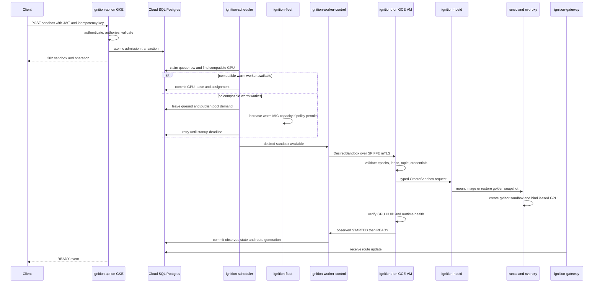

# Ignition Create Sandbox API Specification

**Status:** Current — this is the deployed create/get/list/terminate/watch contract.

**Parent designs:** [Client API and Identity](ignition-design-client-api-identity.md), [Control Plane](ignition-design-control-plane.md), [GKE Sandbox](ignition-design-gke-sandbox.md)  
**Machine-readable schema:** [`api/proto/ignition/v1/sandbox.proto`](../../api/proto/ignition/v1/sandbox.proto) and [`sandbox_service.proto`](../../api/proto/ignition/v1/sandbox_service.proto). How to build and deploy: [Implementation guide](../guides/ignition-implementation.md).

## Purpose

Defines the public API for asynchronously creating one sandbox. This request/response schema, the state machine, idempotency rules, and error model are the canonical public contract and are runtime-agnostic.

**What `ignition-api` implements** (see [Implementation guide](../guides/ignition-implementation.md)):

- `resources`, `placement`, `timeouts`, and `network` are **optional**. Any field left unset is filled from the system [default runtime](ignition-design-default-runtime.md) (`GET /v1/projects/{project}/runtimes/default`); the built-in default is a CPU-only sandbox. The resolved `RuntimeSpec` is snapshotted onto the sandbox. `imageId` is the only required field.
- `resources.accelerator.type` is the AcceleratorType enum (`NVIDIA_L4` or `NONE` for CPU-only); `count` must be `1` for `NVIDIA_L4` and `0`/absent for `NONE`. Platform allowlist `IGNITION_ALLOWED_ACCELERATORS` (default `NONE,NVIDIA_L4`). An accelerator type with no scheduling profile fails `WORKLOAD_NOT_SUPPORTED` with no Pod.
- `imageId` must match `^[a-zA-Z0-9][a-zA-Z0-9._-]{0,127}$`.
- CPU ≤ 8000m, memory ≤ 32768 MiB; caps and timeout validation live in `internal/store/runtime.go` (also applied to the default runtime at startup); command/label caps in `internal/api/limits.go`.
- Internet access is an explicit `ENABLED` / `DISABLED` preference and defaults to `DISABLED`; the selected GCP network profile enforces it.
- `secretRefs` are stored on the sandbox and injected by the controller from Secret Manager at Pod create.
- Cancel of an in-flight create fails the sandbox (`CANCELLED`) and releases quota.
- Terminate/cancel permission deny is `404`; create/exec deny stays `403`.
- Watch emits an SSE snapshot whenever the resource changes, supports `Last-Event-ID`, sends heartbeats, and closes on a terminal state or after ~60s.

Provisioning behavior behind the API:

- **Shipped:** the [GKE Sandbox](ignition-design-gke-sandbox.md) design is normative. `ignition-controller` reconciles admitted sandboxes into gVisor Pods on GKE Sandbox nodes; the warm-capacity startup SLO (target p95 API-to-`READY` ≤ 9 seconds) and its exclusions are defined there.
- **Deferred, not implemented:** the scheduler/worker flow in [Processing flow](#processing-flow) and [Detailed control-plane behavior](#detailed-control-plane-behavior) below is the custom GCE/MIG runtime.

Sandbox creation selects existing warm capacity and never synchronously creates a GPU VM. When no compatible capacity is available, the request stays queued while the GKE Cluster Autoscaler adds a node.

### Placement

RL users do not need to understand GKE, gVisor, node pools, MIGs, or Compute Engine machine families. Placement exposes one optional user-facing compute preference:

```proto
message PlacementSpec {
  string region = 1;
  ComputeEnvironment compute_environment = 2;
}

enum ComputeEnvironment {
  COMPUTE_ENVIRONMENT_UNSPECIFIED = 0; // Treated as STANDARD.
  COMPUTE_ENVIRONMENT_STANDARD = 1;
  COMPUTE_ENVIRONMENT_BARE_METAL = 2;
}
```

- `STANDARD` is the default and recommended value. It requests the normal isolated Ignition sandbox service. The API does not expose that its current implementation is GKE with gVisor.
- `BARE_METAL` is an advanced opt-in for workloads that explicitly require a physical Compute Engine host. Ignition chooses the machine type, image, zone, and fleet implementation.
- Region remains optional and project-policy constrained.
- Spot/on-demand purchasing is removed from the sandbox request. Capacity policy belongs to the project or service plan, not to typical RL workload code.
- Until the bare-metal backend ships, its request is accepted asynchronously and the operation moves to `FAILED` with `COMPUTE_ENVIRONMENT_UNAVAILABLE`; it never silently falls back to `STANDARD`.

The public response echoes the resolved `computeEnvironment`, but backend identifiers remain internal. This plan assumes Compute Engine bare-metal instances, not the separate Google Cloud Bare Metal Solution product.

## Endpoint

```http
POST /v1/projects/{project_id}/sandboxes
Authorization: Bearer ACCESS_TOKEN
Idempotency-Key: UUID
Content-Type: application/json
```

Required OAuth permission: `sandbox.create`.

`Idempotency-Key` is required and retained for at least 24 hours. Reusing it with the same canonical request returns the original sandbox and operation. Reusing it with different content returns `409 IDEMPOTENCY_KEY_REUSED`.

## Request

```json
{
  "name": "model-runner",
  "imageId": "img_01J...",
  "command": ["python", "-m", "server"],
  "workingDirectory": "/workspace",
  "secretRefs": [
    {
      "secretId": "sec_01J...",
      "version": "latest",
      "environmentName": "MODEL_TOKEN"
    }
  ],
  "resources": {
    "cpuMilli": 4000,
    "memoryMiB": 16384,
    "accelerator": {
      "count": 1,
      "type": "NVIDIA_L4"
    }
  },
  "placement": {
    "region": "us-central1",
    "computeEnvironment": "STANDARD"
  },
  "timeouts": {
    "startupSeconds": 120,
    "maximumRuntimeSeconds": 3600,
    "idleSeconds": 600,
    "terminationGraceSeconds": 20
  },
  "network": {
    "internetAccess": "DISABLED"
  },
  "labels": {
    "team": "inference",
    "workload": "reference-model"
  }
}
```

### Fields

- `name`: optional display name, unique only when project policy requires it.
- `imageId`: required. Must match `^[a-zA-Z0-9][a-zA-Z0-9._-]{0,127}$`; the controller resolves it under the Artifact Registry sandbox prefix. Digest pinning is future work.
- `command`: optional argv array. It is never evaluated by a shell. When omitted, Ignition starts its sandbox init supervisor and waits for later `exec` requests. Ignored when `nativeEntrypoint` is `true` (see below); the platform does not reject the combination today, so a caller who sets both is not warned that `command` has no effect.
- `workingDirectory`: optional absolute path inside the image.
- `nativeEntrypoint`: optional, default `false`. When `true`, the sandbox runs the admitted image's own OCI `Entrypoint`/`Cmd` unchanged as PID 1 instead of Ignition's `sandbox-init` supervisor. Use this only for an image that does not embed `sandbox-init`. Effects, all currently permanent for the sandbox's lifetime:
  - **Weaker readiness.** There is no `/readyz` to gate on, so public `READY` falls back to kubelet's default — the Pod is reported `Ready` as soon as every container is `Running`, with no verification that the process inside has finished starting or is functioning. This is materially weaker than the managed-mode `READY` guarantee; do not assume parity.
  - **No exec, idle tracking, or lifecycle hooks.** There is no supervisor to relay them to.
  - **The same security context applies.** `runAsNonRoot: true` and `readOnlyRootFilesystem: true` are not relaxed for this mode. An image that runs as root by default, or that writes outside `/scratch`, will fail to start rather than run with a different isolation posture — this is a functional limitation of the current implementation, not a workaround available to callers.
- `secretRefs`: stored on create; the controller resolves Secret Manager at Pod create and injects env. Values never enter SQL.
- `cpuMilli`: optional, positive, max 8000.
- `memoryMiB`: optional, positive, max 32768.
- `accelerator.type`: `AcceleratorType` enum. Public JSON drops the proto prefix (`ACCELERATOR_TYPE_NVIDIA_L4` → `"NVIDIA_L4"`, `ACCELERATOR_TYPE_NONE` → `"NONE"`). `IGNITION_ALLOWED_ACCELERATORS` defaults to `NONE,NVIDIA_L4`. GCE accelerator name `nvidia-l4` is infra-only, not the API value.
- `accelerator.count`: `1` for `NVIDIA_L4`, `0` for `NONE`.
- `region`: must be enabled for the project. Deployment is single-region (`us-central1`).
- `computeEnvironment`: `STANDARD` (default) or `BARE_METAL`. `STANDARD` hides the managed runtime implementation. `BARE_METAL` never falls back to `STANDARD` when its backend is unavailable.
- `startupSeconds`: maximum queue plus worker activation time before creation fails (max 600).
- `maximumRuntimeSeconds`: hard sandbox lifetime (max 86400).
- `idleSeconds`: inactivity period before termination; active processes or streams count as activity (max 3600).
- `terminationGraceSeconds`: graceful stop period before forced termination (max 120).
- `network.internetAccess`: `DISABLED` (default) or `ENABLED`. This controls outbound public internet access only; it never creates inbound exposure or grants access to private control networks. GCP networking, not per-request CIDR rules, enforces the selected profile.
- `labels`: optional bounded client metadata (max 32); reserved `ignition.*` keys are rejected.

Public Session/runtime snapshots and user-supplied OCI hooks, host mounts, devices, CDI records, capabilities, namespaces, and readiness probes are not accepted.

## Success response

```http
HTTP/1.1 202 Accepted
Location: /v1/projects/prj_01J.../sandboxes/sbx_01J...
Retry-After: 1
```

```json
{
  "sandbox": {
    "id": "sbx_01J...",
    "projectId": "prj_01J...",
    "name": "model-runner",
    "state": "CREATING",
    "stateReason": "ADMITTED",
    "imageId": "img_01J...",
    "operationId": "op_01J...",
    "createdAt": "2026-08-27T04:00:00Z"
  },
  "operation": {
    "id": "op_01J...",
    "kind": "CREATE_SANDBOX",
    "state": "PENDING",
    "resourceId": "sbx_01J...",
    "createdAt": "2026-08-27T04:00:00Z"
  }
}
```

The response confirms durable admission, not readiness.

## Observing progress

```text
GET /v1/projects/{project}/sandboxes/{sandbox}
GET /v1/projects/{project}/operations/{operation}
GET /v1/projects/{project}/operations/{operation}:watch
GET /v1/projects/{project}/events:watch
```

Watch uses authenticated Server-Sent Events. It polls product state, emits content-addressed snapshots when the resource changes, honors `Last-Event-ID` to suppress an acknowledged snapshot, sends heartbeats, and closes on a terminal state or after ~60s.

Public state progression:

```text
CREATING → SCHEDULED → STARTED → READY
any nonterminal state → FAILED
READY → TERMINATING → FINISHED
```

- `CREATING`: admission is durable; the Pod is not yet scheduled.
- `SCHEDULED`: the sandbox Pod is bound to a node (`PodScheduled=True`).
- `STARTED`: the container is running; readiness verification is incomplete.
- `READY`: kubelet `PodReady`, and for `NVIDIA_L4` an `ignition-gpu-agent`-stamped canonical GPU UUID + `init-healthy` annotation. For a `nativeEntrypoint` sandbox there is no `/readyz` behind `PodReady`, so on `NONE` this reduces to "the container is `Running`" with no functional verification; the `NVIDIA_L4` GPU attestation gate is unaffected, since `ignition-gpu-agent` never depends on `sandbox-init`.
- `FAILED`: terminal creation failure; includes a stable reason.

## Processing flow

> **This section (Processing flow and Detailed control-plane behavior) describes
> the deferred custom GCE/MIG runtime and is not implemented.** The shipped
> sequence — `ignition-controller` reconciliation onto GKE Sandbox nodes — is in
> the [GKE Sandbox](ignition-design-gke-sandbox.md) design.



## Detailed control-plane behavior

### 1. Authenticate and authorize

`ignition-api` validates the RFC 9068 access JWT, exact issuer/audience, expiry, client, scopes, and emergency denylist. It loads the project under organization scope and checks `sandbox.create`.

Cross-project IDs return indistinguishable `404 NOT_FOUND`. In-project create/exec deny returns `403 PERMISSION_DENIED`. Terminate/cancel deny returns `404`.

### 2. Validate references and policy

The API verifies:

- image state is `READY`;
- image digest and GPU workload contract are immutable;
- secrets and datasets belong to the project and principal may use them;
- CPU/RAM/GPU, region, timeouts, and egress satisfy project policy;
- project has quota for one additional GPU sandbox;
- request contains no unsupported v1 fields.

### 3. Commit admission

In one serializable Cloud SQL transaction, `ignition-api` writes:

1. idempotency key plus canonical request hash;
2. sandbox row in `CREATING`;
3. create operation;
4. quota-ledger reservation;
5. scheduler queue row;
6. lifecycle event;
7. transactional outbox event.

All seven commit or none commit. API retries the complete transaction after serialization, deadlock, or failover errors.

### 4. Select capacity

`ignition-scheduler` fairly claims a committed queue row. It filters workers by:

- heartbeat and `READY` state;
- one-hostile-tenant-per-VM availability;
- healthy unleased GPU;
- GPU SKU and complete compatibility tuple;
- CPU, RAM, disk, region, and provisioning model;
- image/golden-artifact locality.

The scheduler transaction creates the GPU lease, increments its fencing token, assigns the worker, advances the sandbox to `SCHEDULED`, and emits desired-state/outbox events.

### 5. Replenish warm VMs

`ignition-fleet` observes pool demand independently. If the compatible warm buffer is below target, it increases the appropriate GCE MIG.

The new VM boots from an immutable Ubuntu image, initializes the pinned NVIDIA driver and runtime services, registers through `ignition-worker-control`, performs GPU burn-in, and only then becomes schedulable.

Sandbox creation does not wait inside an API request for this process; the asynchronous operation remains queued until capacity appears or `startupSeconds` expires.

### 6. Deliver desired state

`ignition-worker-control` sends `DesiredSandbox` over the worker's current SPIFFE-mTLS stream. The command includes:

- sandbox and desired-state generation;
- worker owner epoch;
- GPU lease fencing token;
- immutable image and startup-policy identity;
- resource and network policy;
- operation-scoped artifact URLs;
- operation-scoped secret delivery references.

The worker rejects stale epochs, generations, tokens, or tuple mismatches.

### 7. Create the sandbox

`ignitiond` journals the operation and invokes privileged `ignition-hostd` through its typed local API.

`ignition-hostd` is the sole lifecycle owner. It:

1. configures cgroups, namespaces, scratch, and network;
2. requests the image rootfs from containerd content/lazy snapshot services;
3. generates the server-owned OCI specification;
4. selects the pinned, validated NVIDIA CDI device by GPU UUID;
5. restores a compatible golden startup snapshot or performs a cold start;
6. invokes direct `runsc` lifecycle commands;
7. never grants tenant access to the containerd root socket.

`runsc` creates the gVisor sentry/netstack and `nvproxy` exposes only the leased GPU. The host NVIDIA driver remains part of the trusted computing base.

### 8. Verify and publish the route

Before `READY`, the worker confirms:

- expected process/runtime state;
- exact leased GPU UUID is visible;
- no other GPU is visible;
- managed-memory and unsupported CUDA behavior are absent for the allowlisted workload;
- local ingress is registered;
- resource limits are applied.

Worker-control atomically writes observed `READY`, route generation, lifecycle event, and outbox event. The authoritative route is:

```text
(sandbox_id, generation)
→ worker SPIFFE ID
→ private worker endpoint
→ ingress epoch
→ route state
```

`ignition-gateway` updates its route cache and rejects stale generations.

### 9. Client interaction

After `READY`, clients create Process resources and attach via `ignition-gateway`. If create omitted `command`, the sandbox init supervisor waits for exec.

## Failure behavior

- **No capacity before startup deadline:** sandbox becomes `FAILED` with retryable `CAPACITY_UNAVAILABLE`; quota reservation is released through an append-only ledger entry.
- **Image, secret, dataset, policy, or quota error:** reject before admission with a stable 4xx error.
- **Worker lost before readiness:** lease becomes `SUSPECT`; the VM is recreated before GPU reuse. Scheduler may retry another worker within the original startup deadline.
- **Runtime or GPU validation failure:** remove any route, quarantine the VM when device state is ambiguous, and fail or retry according to typed reason.
- **Client disconnect:** creation continues because it is operation-based.
- **Duplicate request:** idempotency returns the original sandbox/operation.
- **Cancellation:** cancelling an in-flight `CREATE_SANDBOX` fails the sandbox (`CANCELLED`) and releases quota so the controller does not create a Pod. Otherwise cleanup and fencing still apply.
- **Control-plane replica failure:** durable Postgres state and owner epochs allow another replica to continue.

## Representative errors

```text
400 INVALID_ARGUMENT
401 UNAUTHENTICATED
403 PERMISSION_DENIED
404 NOT_FOUND
409 IDEMPOTENCY_KEY_REUSED
409 IMAGE_NOT_READY
422 WORKLOAD_NOT_SUPPORTED
429 QUOTA_EXCEEDED
429 RATE_LIMITED
503 CAPACITY_UNAVAILABLE
503 UNAVAILABLE
```

Error body:

```json
{
  "error": {
    "code": "CAPACITY_UNAVAILABLE",
    "message": "No compatible L4 worker became ready before the startup deadline.",
    "requestId": "req_01J...",
    "retryable": true,
    "retryAfterSeconds": 10,
    "details": {
      "region": "us-central1",
      "accelerator": "NVIDIA_L4"
    }
  }
}
```

## Security invariants

- One hostile project sandbox per GPU VM.
- Exactly one active lease per GPU.
- No worker is reused after ambiguous process/device cleanup.
- Client input cannot add hooks, devices, host mounts, capabilities, or namespaces.
- Worker receives no broad project artifact or Secret Manager credential.
- `READY` is impossible before GPU verification (and route verification once the data plane exists).
- Sandbox traffic never uses the control-plane API path.
- GCE metadata, management sockets, and other sandbox addresses are unreachable.

## Launch acceptance tests

1. Create 100 identical requests with one idempotency key; assert one sandbox and operation.
2. Race concurrent creates for one GPU; assert one active lease.
3. Create with no warm capacity; assert asynchronous queueing, MIG demand, and bounded timeout.
4. Kill API, scheduler, worker-control, and gateway replicas at each state transition; assert convergence.
5. Disconnect a scheduled worker; assert `SUSPECT` and VM recreation before GPU reuse.
6. Inject wrong GPU UUID, stale owner epoch, and stale fencing token; assert rejection.
7. Verify a sandbox cannot see another GPU, metadata service, host mounts, or worker credentials.
8. Restore from locally cached golden state and meet scoped p95 application-ready target of 20 seconds for the validated L4 workload with at most 8 GiB captured VRAM.
9. Cold start the validated L4 image and meet p95 application-ready target of 120 seconds.
10. Verify exec attachment succeeds within p95 1 second after `READY`.
