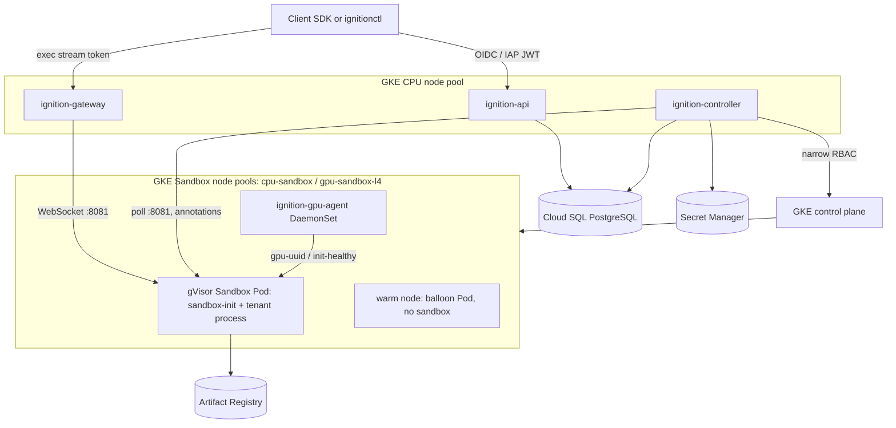

# Ignition shipped architecture

**Status: SHIPPED.** This is the architecture Ignition runs — `ignition-api` +
`ignition-controller` on GKE, sandboxes as gVisor Pods on GKE Sandbox node
pools. Per-feature status is in [STATUS.md](STATUS.md); build and deploy steps
are in the [implementation guide](../guides/ignition-implementation.md).

**Public contract:** [API contract](ignition-api-contract.md) ·
**Protos:** [`api/proto/ignition/v1/`](../../api/proto/ignition/v1/)

## 1. Overview

Ignition runs untrusted tenant code — single-GPU CUDA workloads, CPU workloads,
coding / tool-use agents, and RL environments (rollout workers) — in isolated
sandboxes. GKE owns VM lifecycle, drivers, scheduling, and autoscaling; Ignition
owns the public API, authorization, and reconciliation. The caller supplies the
workload: an agent harness, a verifier, a trainer, or an inference server all run
outside Ignition (see [`examples/agentic-rl/`](../../examples/agentic-rl/) and
the [roadmap](ROADMAP.md)).



### Services

| Service | Role | Kubernetes RBAC | Cloud SQL |
|---|---|---|---|
| `ignition-api` | Public HTTP/JSON API. Authenticates, authorizes, validates, admits, enforces quota + idempotency. **Never calls Kubernetes.** Sole writer of *desired* state. Owns DDL (`store.Open`). | none | full DML + DDL (product + idempotency + quota) |
| `ignition-controller` | Internal reconciler. Reads desired state, creates/deletes Pods, writes *observed* public state. Sole holder of Pod RBAC. DML only (`store.OpenWithoutSchema`). | Pods in `ignition-sandboxes`; get/list/patch Nodes, cordon only if `ignition.io/node-pool=gpu-sandbox-l4` | DML: sandbox/process/operation/lease, no DDL |
| `ignition-gateway` | Exec data plane. Validates the `ignition-api`-minted stream token, resolves the sandbox Pod by label (READY + generation-fenced), proxies the attach WebSocket to `sandbox-init`. Never parses frames. | namespaced Pod get/list in `ignition-sandboxes` | none |
| `ignition-gpu-agent` | Privileged DaemonSet on the GPU pool. Attests GPU identity + health, gates node reuse. | (node-scoped, on the GPU pool) | none |
| `sandbox-init` (`/ignition/init`) | In-sandbox PID 1. Readiness probe + tenant-process supervisor + exec stdio server on `:8081`. Holds **no** Kubernetes credential. | none | none |

`ignition-api`, `ignition-controller`, and `ignition-gateway` share the repo but
deploy as separate Deployments with distinct KSAs and Workload Identity
bindings. A combined binary is rejected: the public listener would inherit Pod
create/delete, and a controller compromise would inherit token minting.

**Database roles.** Today all three connect to Cloud SQL as one role
(`google_sql_user.ignition`, password DSN) — the DML-scoping in the table above
is the code-level contract (`store.Open` vs `store.OpenWithoutSchema`), not yet
a database-enforced grant. Distinct per-service DB roles with IAM auth and
table-scoped `GRANT`s are the staging/prod path (see [§9](#9-data-model)).

### Managed dependencies

| Concern | Managed service |
|---|---|
| VM lifecycle, drivers, autoscaling | GKE Standard node pools + Cluster Autoscaler |
| Sandbox isolation runtime | GKE Sandbox (gVisor `runsc` + `nvproxy`) |
| Container images | Artifact Registry + GKE image streaming |
| Secrets | Secret Manager (referenced by ID, resolved by the controller) |
| Durable product state | Cloud SQL for PostgreSQL (regional HA on dev) |
| Logs, metrics, traces | Cloud Logging / Cloud Monitoring |

**Deployment is regional.** One GKE cluster and one Cloud SQL instance in
`us-central1` (three zones). The hostname may be global (anycast HTTPS frontend);
exec uses a regional `gatewayUrl`. A second region is a second full stack plus
routing on `placement.region`. Do not run a globally writable Postgres.

## 2. Cluster and node pools

- GKE Standard, regional, release channel pinned to a version with GA GKE
  Sandbox GPU support (L4). **Dataplane V2** enabled at creation.
- Dedicated minimal node service account (`roles/container.defaultNodeServiceAccount`);
  Shielded nodes, Secure Boot, Workload Identity (`GKE_METADATA`), legacy
  metadata disabled.
- **CPU node pool:** `ignition-api`, `ignition-controller`, `ignition-gateway`,
  system workloads. Three zones, topology spread, PodDisruptionBudgets.
- **Sandbox node pools** (`internal/k8s/profile.go` is the source of truth):

| Accelerator | Restricted pool | Internet pool | Device request | One per node | Taint |
|---|---|---|---|---|---|
| `NONE` (CPU) | `cpu-sandbox` | `cpu-sandbox-internet` | none | no | `ignition.io/sandbox=true` |
| `NVIDIA_L4` | `gpu-sandbox-l4` | `gpu-sandbox-l4-internet` | `nvidia.com/gpu: 1` | yes (hostname anti-affinity) | `ignition.io/gpu-sandbox=true` |

  GPU pool nodes: `g2-standard-8` class (exactly one L4), Container-Optimized OS,
  `--sandbox type=gvisor`, GKE-managed NVIDIA driver, image streaming, no public
  IPs (private + Cloud NAT), autoscaling bounds from GPU quota and budget.
  `network.internetAccess = ENABLED` schedules onto the matching internet pool
  (separate subnet, Pod range, node tag, NAT scope, firewall) in the same
  cluster — not a separate cluster.

## 3. Control plane: `ignition-api`

### Transport

- HTTP internally; TLS terminates at the load balancer. Public JSON uses proto
  `json_name` (lowerCamelCase); enums drop the prefix (`SANDBOX_STATE_READY` →
  `"READY"`).
- `Authorization: Bearer` on every route. `Idempotency-Key` required on create,
  terminate, operation-cancel, and process create/attach/signal/cancel.
- Watch is **SSE** — content-addressed snapshot on change, `Last-Event-ID`,
  15s heartbeats. A Postgres `LISTEN/NOTIFY` trigger on `sandboxes`/`operations`
  wakes the stream on any write (from `ignition-api` or `ignition-controller`),
  so changes push in <1s; a 10s poll is only a backstop. Stays open until the
  resource is terminal, the client disconnects, or a 30-minute cap.

### Authentication and authorization

`internal/auth` verifies (JWKS, ≤ 60s skew), in order of preference:

1. **Cloud IAP assertion** (`X-Goog-IAP-JWT-Assertion`, ES256, issuer
   `https://cloud.google.com/iap`, `aud` = `IGNITION_IAP_AUDIENCE`) when present;
2. **Google ID token** (`Authorization: Bearer`, issuer
   `https://accounts.google.com`, RS256, `aud` ∈ configured audiences,
   `email_verified`, and `hd` ∈ hosted domains for non-service-account subjects);
3. **first-party RFC 9068 `at+jwt`** when `IGNITION_OIDC_ALLOWED_TYPES` allows it.

`IGNITION_OIDC_SUBJECT_CLAIM=email` makes the verified email the RBAC subject; a
`*.gserviceaccount.com` email is a service account (no hosted-domain check, no
role cap). Then load `role_bindings` for `(project_id, subject)` — exact subject,
then a `domain:<hd>` fallback. **SQL is project-scoped before the object row is
loaded.** Cross-project or unknown IDs return indistinguishable `404`; in-project
missing permission is `403` for create/exec, `404` for terminate/operation-cancel
(so existence is not leaked).

Staging/prod refuse to start with `IGNITION_DEV_BEARER`, a missing issuer, or the
default stream secret. The `dev` overlay has no Ingress and uses
`IGNITION_DEV_BEARER` (subject `dev`). Operators seed one `projects` row and the
first `owner`; `roleBindings` CRUD (owner/admin, last-owner guard, audit line)
manages the rest. Full permission matrix: [API contract](ignition-api-contract.md#project-rbac).

### Create sandbox (admission)

One serializable Cloud SQL transaction; the API never creates a Pod:

1. canonicalize the body, hash with method + route + principal + project;
2. insert `idempotency_keys` — same hash replays the stored `202`; in-progress →
   `409 IDEMPOTENCY_IN_PROGRESS`; different hash → `409 IDEMPOTENCY_KEY_REUSED`;
3. merge `resources`/`placement`/`timeouts`/`network` over the [default
   runtime](#6-default-runtime), validate the resolved `RuntimeSpec` (accelerator
   allowlist, counts, CPU ≤ 8000m, memory ≤ 32768 MiB, timeout caps, enums),
   validate `command`/`label` caps and `secretRefs`;
4. insert `sandboxes` (`CREATING`, `generation = 1`);
5. insert `operations` (`CREATE_SANDBOX`, `PENDING`);
6. increment `project_quota.active`;
7. commit, return `202 { sandbox, operation }`.

`timeouts.startupSeconds` is stored; the **controller** fails the sandbox with
`CAPACITY_UNAVAILABLE` if `READY` is not reached in time. The API does not wait.

### Terminate, cancel, process, watch

- **Terminate:** set desired `TERMINATING`, insert an operation if none open,
  `202`. Already-terminal replays success.
- **Cancel** an in-flight `CREATE_SANDBOX`: sandbox → `FAILED`/`CANCELLED`,
  release quota, prevent Pod create.
- **Process** (requires sandbox `READY`): create persists argv/cwd/env/pty and
  returns immediately; **attach** mints a short-lived exec stream token (audience
  ≠ access JWT) bound to `project_id`, `sandbox_id`, `generation`, `process_id`,
  `stream_epoch`, action `attach`, and returns `{ streamToken, gatewayUrl,
  expireTime, streamEpoch }`; signal/cancel are idempotent row updates. Bytes
  never enter `ignition-api`.
- **List:** cursor pagination, order `(create_time, id)`, project filter, SQL
  `LIMIT`. **Watch:** snapshot, then push-on-change via `LISTEN/NOTIFY` (10s poll
  backstop), heartbeats, open until terminal / disconnect / 30-minute cap.

API crash after commit is safe: the operation is durable, the controller
proceeds, clients reconnect with watch/`GET`. No cross-replica lock — the
idempotency table is the lock.

## 4. Control plane: `ignition-controller`

Cloud SQL is authoritative for desired state; the Kubernetes watch is a hint. The
controller is level-triggered and idempotent. Pod names are deterministic
(`sbx-{sandbox_id}` in `ignition-sandboxes`), so a restart or duplicate reconcile
never makes a second Pod.

```text
for each sandbox in SQL:
  CREATING + no Pod, valid imageId  → create Pod (server-owned spec)
  invalid imageId                   → FAILED IMAGE_UNAVAILABLE (no Pod)
  PodScheduled=True                 → SQL SCHEDULED
  container running                 → SQL STARTED
  PodReady (+ GPU: init-healthy + gpu-uuid annotations) → SQL READY
  desired TERMINATING               → delete Pod; on gone → FINISHED
  CREATE cancelled                  → SQL already FAILED; do not create
  READY + idle > timeouts.idleSeconds → delete Pod; FINISHED / IDLE_TIMEOUT
  startup deadline exceeded         → FAILED CAPACITY_UNAVAILABLE / STARTUP_TIMEOUT
  Pod Failed / DeadlineExceeded     → FAILED RUNTIME_LIMIT_EXCEEDED (max-runtime kill)
  Pod Failed / other               → FAILED WORKER_LOST
  Pod gone unexpectedly            → FAILED WORKER_LOST; release quota; restore balloon
  GPU cleanup ambiguous            → GET node; cordon only if gpu-sandbox-l4
```

| Public state | Trigger |
|---|---|
| `CREATING` | admitted; Pod not scheduled |
| `SCHEDULED` | `PodScheduled=True` |
| `STARTED` | container running; readiness incomplete |
| `READY` | CPU: kubelet `PodReady`. GPU: `PodReady` **and** `ignition-gpu-agent` stamped `ignition.io/init-healthy=true` + a canonical `ignition.io/gpu-uuid` (`GPU-…`). `PodReady` alone is `STARTED`. |
| `FAILED` | terminal Pod failure, deadline, image error, node loss |
| `TERMINATING` / `FINISHED` | terminate requested / Pod deleted and cleanup verified |

**Concurrency:** two replicas with a SQL lease (`controller_leases`,
`FOR UPDATE SKIP LOCKED`, ~10s). Only the lease holder mutates Pods. Kubernetes
leader election is not the only lock — Cloud SQL must stay authoritative if the
API server is partitioned.

**Secrets:** resolved from Secret Manager at Pod create using the controller's
Google identity and injected as container env in the Pod spec — never as cluster
`Secret` objects other namespaces can read. Sandbox Pods have
`automountServiceAccountToken: false` and no Workload Identity.

## 5. Sandbox Pod profile (normative)

The controller generates the entire Pod spec server-side. **No client field maps
to hooks, devices, host mounts, capabilities, namespaces, or scheduling.**

```yaml
apiVersion: v1
kind: Pod
metadata:
  name: sbx-01j...
  namespace: ignition-sandboxes
  labels:
    ignition.io/workload: gpu-sandbox
    ignition.io/sandbox-id: sbx-01j...
    ignition.io/project-id: prj-01j...
spec:
  runtimeClassName: gvisor
  priorityClassName: ignition-sandbox        # preempts ignition-balloon
  automountServiceAccountToken: false
  enableServiceLinks: false
  restartPolicy: Never
  activeDeadlineSeconds: 3600                 # maximumRuntimeSeconds
  terminationGracePeriodSeconds: 20
  nodeSelector: { ignition.io/node-pool: gpu-sandbox-l4 }
  tolerations:
    - { key: ignition.io/gpu-sandbox, operator: Equal, value: "true", effect: NoSchedule }
  affinity:
    podAntiAffinity:
      requiredDuringSchedulingIgnoredDuringExecution:
        - labelSelector: { matchLabels: { ignition.io/workload: gpu-sandbox } }
          topologyKey: kubernetes.io/hostname
  securityContext:
    runAsNonRoot: true
    seccompProfile: { type: RuntimeDefault }
  containers:
    - name: sandbox
      image: REGION-docker.pkg.dev/…@sha256:DIGEST
      command: ["/ignition/init"]             # server-owned supervisor
      securityContext:
        allowPrivilegeEscalation: false
        readOnlyRootFilesystem: true
        capabilities: { drop: ["ALL"] }
      resources:
        requests: { cpu: "4", memory: 16Gi, nvidia.com/gpu: "1" }
        limits:   { cpu: "4", memory: 16Gi, nvidia.com/gpu: "1" }
      volumeMounts: [{ name: scratch, mountPath: /scratch }]
  volumes:
    - name: scratch
      emptyDir: { sizeLimit: 20Gi }
```

### Isolation invariants

- **One customer sandbox per host.** The node has one GPU, the Pod requests the
  whole GPU, and hostname anti-affinity independently blocks co-scheduling. Both
  must hold. GPU time-sharing, MPS, and MIG are disabled; `nvidia.com/gpu` is
  always exactly `1`. System DaemonSets and `ignition-gpu-agent` still run on the
  node — the guarantee is one *customer* sandbox, not literally one Pod.
- **VM boundary.** A gVisor/driver compromise is contained to one GCE node
  hosting one customer sandbox.
- **No cluster credentials.** `automountServiceAccountToken: false`; the sandbox
  namespace default SA has no RBAC.
- **Metadata blocked.** The GCP network profile blocks `169.254.169.254`, private
  control-plane ranges, Cloud SQL, and cross-tenant traffic regardless of
  internet setting. `ENABLED` permits outbound public traffic only; it creates no
  inbound exposure. Any cluster NetworkPolicy is defense in depth, never derived
  from client input.
- **Read-only root.** `readOnlyRootFilesystem: true`; `/scratch` emptyDir is the
  only writable path. Security context is identical for `nativeEntrypoint`.
- **Server-owned images and init.** The controller resolves `imageId` under the
  Artifact Registry sandbox prefix (digest pinning is future work). Default
  entrypoint is `sandbox-init`; a managed sandbox's `command`/`args` become a
  supervised main process (a `Process` row), not the container command.
  `CreateSandbox.nativeEntrypoint` (opt-in) runs the image's own
  `Entrypoint`/`Cmd` as PID 1 instead, with `command`/`args` overriding them
  Kubernetes-style — no `/readyz` gate (public `READY` falls back to kubelet's
  `Running ⇒ Ready`), no exec, no idle tracking;
  the security context is not relaxed, so an image that runs as root or writes
  outside `/scratch` fails to start.

### GPU attestation and node reuse (`ignition-gpu-agent`)

A privileged DaemonSet on `gpu-sandbox-l4` (one Pod per node, no `nvidia.com/gpu`
request). Because each node has one GPU and one sandbox, it maps that GPU onto
the sandbox Pod, verifies via NVML (`nvidia-smi`) that the GPU is healthy and
carries no residual compute processes, and patches `ignition.io/gpu-uuid` +
`ignition.io/init-healthy` onto the Pod. The controller requires that before
`READY`.

After a sandbox Pod is gone, the agent re-checks the GPU (residual processes,
ECC, reset-required). If it cannot prove the GPU clean it annotates the **Node**
`ignition.io/gpu-cleanup=ambiguous`; the next teardown reconcile GETs the node
and cordons only if `ignition.io/node-pool=gpu-sandbox-l4`, and GKE recreates it.
Cordon errors fail the reconcile. A clean node returns to the warm pool
untouched.

`sandbox-init`'s GPU readiness probe stats the device nodes, runs `nvidia-smi`
for a canonical UUID + ECC health, and runs a `cuInit()` helper (`cmd/cuda-check`)
— it never reads `NVIDIA_VISIBLE_DEVICES` or a device-node name.

## 6. Default runtime

Callers should not have to spell out compute/placement/timeout/network on every
create. The **default runtime** is a system-managed `RuntimeSpec` that fills any
unset field. There is no project-level template resource.

```
RuntimeSpec {
  resources { cpuMilli, memoryMiB, accelerator { type, count } }
  placement { region, computeEnvironment }
  timeouts  { startupSeconds, maximumRuntimeSeconds, idleSeconds, terminationGraceSeconds }
  network   { internetAccess }
}
```

On `CreateSandbox` every field is optional. The request is parsed into a partial
`RuntimeSpec`, merged field-by-field over the default, validated against platform
caps, and **snapshotted** onto the sandbox; later default changes never affect
existing sandboxes. `GET /v1/projects/{project}/runtimes/default` (permission
`runtime.get`, every role) returns the resolved default.

- **Built-in fallback** (`store.BuiltinDefaultRuntime`): CPU-only — `NONE`,
  1000m, 2048 MiB, `internetAccess = DISABLED`, `computeEnvironment = STANDARD`,
  timeouts 120/3600/600/20s.
- **Operator override** `IGNITION_DEFAULT_RUNTIME` (JSON, merged over the
  built-in), validated at startup against caps + `IGNITION_ALLOWED_ACCELERATORS`
  (default `NONE,NVIDIA_L4`); a bad value fails the process.

Only `NONE` and `NVIDIA_L4` profiles exist; the controller fails a sandbox
`WORKLOAD_NOT_SUPPORTED` (no Pod) when the accelerator type has no profile.
`internal/k8s/profile.go` is the extension point (TPU / other GPU SKUs are out of
scope).

*(The earlier `SandboxTemplate` project resource from the multi-accelerator plan
was not built; the default runtime replaced it. The Phase-0 accelerator model
landed as described.)*

## 7. Warm-node capacity

Sandbox Pods scale to zero; configured **nodes** do not. A warm node is a `Ready`
GKE sandbox node with runtime dependencies available and no customer sandbox.

- The controller keeps an independent warm buffer per accelerator class:
  `target_warm = clamp(ceil(p95_creates_per_minute × node_provision_minutes ×
  safety), min_warm, max_warm)`. Rate from recent `sandboxes` rows over
  `IGNITION_WARM_WINDOW_SECONDS`; `IGNITION_NODE_PROVISION_SECONDS` sets the
  horizon. GPU bounds `IGNITION_MIN_WARM` / `IGNITION_MAX_WARM`; CPU bounds
  `IGNITION_MIN_WARM_CPU` / `IGNITION_MAX_WARM_CPU` (both default 0 — an upgrade
  adds no node cost).
- Implemented with **balloon Pods**: `priorityClassName: ignition-balloon`
  (negative priority, full device request) keep the Cluster Autoscaler from
  removing warm nodes. A real sandbox Pod (`ignition-sandbox`) preempts a balloon
  instantly, landing on a `Ready` node; the autoscaler replenishes the balloon in
  the background (**outside** the startup SLO).
- **Scale-in:** when warm nodes exceed target for a cooldown (default 15 min) the
  controller deletes balloons and lets the autoscaler remove empty nodes. Nodes
  hosting a sandbox are never candidates (the Pod blocks removal, plus a
  `cluster-autoscaler.kubernetes.io/scale-down-disabled=true` annotation).
- **Overload:** creates outpacing the buffer stay `CREATING`; the operation stays
  `RUNNING` until `startupSeconds`, then `CAPACITY_UNAVAILABLE` (retryable). The
  API sheds with `429 RATE_LIMITED` before admission on quota.

### Startup SLO

For a qualified image with pre-warmed capacity, **p95 API-ingress-to-`READY` ≤ 9
seconds**. Qualified = same-region Artifact Registry, stream-eligible, entrypoint
reaches `sandbox-init` without model loading on the critical path.

```text
API admission + Cloud SQL commit          ≤ 0.5 s
controller pickup + Pod creation          ≤ 1.0 s
GKE scheduling onto warm node (preempt)    ≤ 1.5 s
sandbox start: runsc + nvproxy + CDI       ≤ 3.0 s
image streaming mount (cached metadata)    ≤ 1.5 s
readiness verification                     ≤ 1.5 s
------------------------------------------------
total p95 budget                          ≤ 9.0 s
```

Each stage is measured independently. **Outside** the SLO (separate metrics
`queue_wait_seconds`, `node_provision_seconds`, `cold_image_start_seconds`;
cold-node target p95 ≤ 4 min): new-node provisioning, first-ever pull of a
non-streamable image, application init (weight loading), and requests queued on
exhausted capacity.

## 8. Exec data plane

`ignition-api` mints the token; `sandbox-init` owns the process end;
`ignition-gateway` proxies bytes. No `ignition-ingress`, no Postgres route table,
no outbox, no durable spool — those are the [deferred
runtime](ignition-deferred-runtime.md).

### Process observation (controller ↔ `sandbox-init`)

- **Desired → supervisor.** The controller writes the
  `ignition.io/process-desired` annotation (JSON map `processId → {command,
  workingDirectory, environment, pty, ptyRows, ptyCols, signal, cancel}`). A
  `downwardAPI` projected volume mirrors it to `/etc/ignition/pod/process-desired`,
  which `sandbox-init` polls. The sandbox holds no Kubernetes credential.
- **Observed → controller.** `sandbox-init` runs/signals/reaps the processes and
  serves `GET :8081/v1/processes` (`{processes: {processId → {state, exitCode,
  signal}}, idleSeconds}`). The controller polls it each reconcile, advances
  `processes.state`, and mirrors the process map into `ignition.io/process-observed`.

Failed in-sandbox create → `FAILED` with a typed reason. Signal/cancel stay SQL
desired-state until the supervisor reports `EXITED`/`FAILED`. When `pty: true`
(with optional `ptyRows`/`ptyCols`), `sandbox-init` allocates a real PTY —
`Setsid` + `Setctty`, initial `TIOCSWINSZ` — and the master is the single
bidirectional stream endpoint; output is merged on the stdout channel. Mid-session
resize is not wired.

**Idle timeout.** `sandbox-init` reports `idleSeconds` — time with no process in
`STARTING`/`RUNNING` and no attached exec stream (0 while active). When a `READY`
sandbox's `idleSeconds` reaches `timeouts.idleSeconds` (and that value is > 0),
the controller deletes the Pod and finalizes the sandbox `FINISHED` /
`IDLE_TIMEOUT`, releasing quota. `nativeEntrypoint` sandboxes have no supervisor
and so no idle enforcement. `timeouts.maximumRuntimeSeconds` is enforced
separately by the Pod's `activeDeadlineSeconds`; kubelet then fails the Pod
`DeadlineExceeded`, which the controller maps to `FAILED` /
`RUNTIME_LIMIT_EXCEEDED` (not `WORKER_LOST`).

### Byte stream (`ignition-gateway`)

1. Client calls `Attach` (§3) → `{ streamToken, gatewayUrl }`.
2. Client opens a WebSocket to `gatewayUrl` + `/v1/attach?token=<streamToken>`.
3. Gateway verifies with `IGNITION_STREAM_TOKEN_SECRET` and audience `gatewayUrl`
   (`internal/streamtoken`: HS256, `typ=stream+jwt`, issuer `ignition-api`, exact
   audience, expiry, `action=attach`).
4. Gateway resolves `sandbox_id` to a Pod by the `ignition.io/sandbox-id` label,
   rejecting a Pod that is not `READY` or whose generation ≠ the token's.
5. Gateway dials `ws://<podIP>:8081/v1/processes/<process_id>/attach` and copies
   messages both ways until either side closes.

`sandbox-init` fans stdout/stderr to attachers with a small **in-memory** replay
buffer (not a durable spool), writes client stdin to the process, and sends a
terminal `{channel:"control",kind:"exit",exitCode,signal}` frame. Encoding is
`internal/execframe` (JSON; `[]byte` base64). The `sandbox-supervisor-ingress`
NetworkPolicy (`deploy/k8s/base/sandbox-network-policies.yaml`) admits `:8081`
only from `ignition-controller` and `ignition-gateway` — the only
control-plane↔sandbox path.

`gatewayUrl` is the **regional** gateway hostname; a token is invalid on any
other region's gateway. Every overlay deploys `ignition-gateway`: `staging` and
`prod` front it with a public `Ingress` + `ManagedCertificate` (backend
`timeoutSec: 3600` for the long-lived WebSocket); `dev` and `anyscale-staging`
have no public DNS, so exec goes through `kubectl port-forward svc/ignition-gateway
8443:8080` and `IGNITION_GATEWAY_URL` is `http://127.0.0.1:8443`.

## 9. Data model

```text
projects           role_bindings      images            -- images: seed rows; Image APIs are a v0 slice
sandboxes          processes          operations
idempotency_keys   project_quota      controller_leases  -- project_quota is a count, not a ledger
```

An `AFTER INSERT OR UPDATE` trigger on `sandboxes` and `operations`
(`ignition_notify_watch`) issues `pg_notify('ignition_watch', …)`, which
`ignition-api` `LISTEN`s on to push `:watch` streams.

Complete baseline schema (`internal/store/schema.sql`, embedded), not a migration
chain. Every customer row has non-null `project_id`. Indexes `(project_id, id)`,
`(project_id, state)`, and `(sandbox_id)` on processes. `ignition-api` owns DDL
(`store.Open`); `ignition-controller` is DML only (`store.OpenWithoutSchema`).
Cloud SQL: regional HA on dev, private IP, Auth Proxy sidecar, Workload Identity;
a password DSN today, IAM DB users are the staging/prod path.

## 10. Storage

Sandbox storage is a writable `/scratch` emptyDir plus the immutable OCI image.

- **Scratch** belongs to exactly one `(project_id, sandbox_id, generation)`, has
  byte + inode quotas reserved before start, and is deleted on cleanup.
  Exhaustion returns an explicit storage error and cannot consume reserved
  capacity. **Scratch is lost on node loss** — part of the public contract;
  rescheduling starts empty. Sensitive long-lived data should not be placed
  there.
- **Read-only dataset / artifact mounts** and content caches are designed but
  **not built**. When built: an immutable, project-authorized, digest-verified
  version fetched and verified by a trusted service and presented read-only;
  tenant input never becomes a host path; remount-writable / undeclared host path
  / cross-mount attempts fail closed.
- **Writable persistent Volumes and public SESSION memory snapshots are out of
  scope** — they would need a selected backend and defined placement, durability,
  consistency, fencing, backup, encryption, quota, and billing semantics before
  any resource, endpoint, SDK handle, or permission is introduced.

## 11. Failure behavior

| Event | Outcome |
|---|---|
| Warm capacity exhausted | stays `CREATING`; `CAPACITY_UNAVAILABLE` at `startupSeconds` |
| Pod unschedulable (quota / zone stockout) | same queueing; controller emits a capacity event |
| Image pull/stream failure | `FAILED` `IMAGE_UNAVAILABLE`; quota released |
| Node lost while running | Pod disappears → `FAILED` `WORKER_LOST`; quota released; no transparent recovery |
| Controller crash | deterministic Pod names + SQL state → resume-safe; no duplicate Pods |
| API crash after commit | operation is durable; any replica proceeds |
| Client disconnect | creation continues; re-attach via operation watch |
| Terminate | delete Pod with grace, verify teardown + GPU health, `FINISHED`, return node to warm pool (or recreate on ambiguity) |

## 12. Observability

Metrics (region / SKU / project labels where safe): per-stage startup latency vs
the 9s budget; warm buffer size vs target, balloon preemptions, node provision
time; GPU node utilization (active vs warm-idle minutes); queue depth, oldest
queued age, `CAPACITY_UNAVAILABLE` rate; API request count/latency/status,
idempotency replay vs conflict; admission transaction time (budget 0.5s p95);
controller pickup lag, Pod create latency, reconcile errors, lease holder; cost
per sandbox-hour. Traces carry `request_id` from API → SQL operation id → Pod
name. Logs exclude argv payloads, env values, stdin/stdout, and secret material.

## 13. Acceptance tests

1. **One sandbox per host** — two Pods cannot co-schedule on one L4 node (GPU
   request alone, and anti-affinity alone).
2. **Exclusive GPU** — inside `READY`, exactly one GPU with the assigned UUID is
   visible; no other node devices, metadata, cluster IPs, or Pods.
3. **Warm-path SLO** — 100 creates with the buffer at target: p95 API-to-`READY`
   ≤ 9s; per-stage budgets hold.
4. **Cold-node path** — drain the buffer: creates queue, autoscaler restores
   capacity (p95 ≤ 4 min), `CAPACITY_UNAVAILABLE` only after `startupSeconds`.
5. **Idempotency** — 100 concurrent creates, one key → one Pod, one sandbox, one
   operation; a mutated body → `IDEMPOTENCY_KEY_REUSED`.
6. **Controller crash** at every transition → converges, no duplicate/orphaned
   Pods.
7. **Node loss** → `FAILED`/`WORKER_LOST`, quota release, buffer restoration.
8. **Ambiguous cleanup** → node cordoned and recreated before any new sandbox
   lands.
9. **No credentials** — from inside a sandbox: no SA token, no usable metadata
   identity, no Kubernetes API.
10. **CLI conformance** — `create --wait`, `exec`, `terminate --wait`, `-o json`
    pass the black-box suite; exit codes stable.
11. **`ignition-api` has no Kubernetes client** in its import graph and no RBAC
    in its KSA.
12. **Exec attach** p95 ≤ 1s from authenticated attach on a `READY` sandbox
    (gateway SLO; the API only mints the token).
