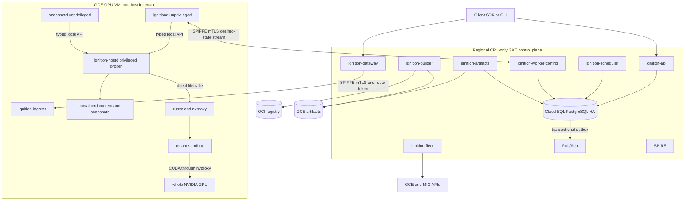

# Ignition Technical Design

**Status:** Current — GKE Sandbox architecture is built and deployed; the custom runtime (modules 4–9) is deferred and not implemented.  
**Deployment:** GKE Standard with GKE Sandbox node pools — see [GKE Sandbox](ignition-design-gke-sandbox.md)  
**API build and deploy:** [Implementation guide](../guides/ignition-implementation.md)

## Architecture: GKE Sandbox

The implementation is the [GKE Sandbox](ignition-design-gke-sandbox.md) architecture: `ignition-api` and `ignition-controller` on a GKE CPU node pool, with one hostile customer sandbox per GKE Sandbox (gVisor/`nvproxy`) node — one whole GPU per `NVIDIA_L4` sandbox, or a CPU-only (`accelerator: NONE`) sandbox on a shared gVisor pool. GKE owns VM lifecycle, drivers, scheduling, and autoscaling; Ignition owns the public API, authorization, and reconciliation. `ignition-gateway` (the exec data plane) is specified but not built.

The custom GCE/MIG worker runtime specified in modules 4–9 below is **not implemented**. It is retained as the design of record for a possible future optimization, gated on measured evidence that GKE cannot meet requirements: the warm-capacity startup SLO, committed golden CPU+GPU memory snapshots (CUDA checkpoint/restore), stricter driver/`nvproxy` tuple pinning, or lifecycle fencing beyond Kubernetes semantics. The gating criteria are in the [GKE Sandbox](ignition-design-gke-sandbox.md) design. Public API, identity, data-plane, and storage contracts are runtime-agnostic and apply to both.

## Module design index

This document is the architecture overview and cross-module contract. The module designs are authoritative for detailed behavior, schemas, protocols, and acceptance tests:

1. [GKE Sandbox](ignition-design-gke-sandbox.md) — the shipped architecture
2. [Client API and Identity](ignition-design-client-api-identity.md) — built
3. [Control Plane](ignition-design-control-plane.md) — built for the GKE path; custom-runtime services deferred
4. [Scheduler and GPU Leasing](ignition-design-scheduler-leasing.md) — deferred, not implemented
5. [Fleet and VM Lifecycle](ignition-design-fleet-vm-lifecycle.md) — deferred, not implemented
6. [Worker Runtime and GPU Isolation](ignition-design-worker-runtime.md) — deferred, not implemented
7. [Images and Startup Acceleration](ignition-design-images-startup.md) — deferred, not implemented
   - [Image Data Layer](ignition-design-image-datalayer.md) — backend-neutral admission and adaptive GKE/GCE image delivery for arbitrary OCI images; proposed, not implemented
   - [Fast Startup on GCP](ignition-design-fast-startup-gcp.md) — content-derived re-layering, ReadOnlyMany weight disks, managed Pod snapshot qualification, data-locality warm pool; proposed, not implemented
8. [Checkpoint and Restore](ignition-design-checkpoint-restore.md) — managed GKE Pod snapshot orchestration not built; direct custom-runtime path deferred
9. [Data Plane and Networking](ignition-design-data-plane-networking.md) — exec byte path not built; `ignition-ingress`/route table/exec spool are custom-runtime
10. [Storage and Volumes](ignition-design-storage-volumes.md) — scratch and read-only mounts only; Volumes deferred
11. [Production Operations and Security](ignition-design-production-operations-security.md)
12. [Create Sandbox API and Control-Plane Flow](ignition-sandbox-create-api.md) — built
13. [Implementation guide](../guides/ignition-implementation.md) — how to build the binaries, create the cluster, and deploy on GKE

If this overview and a module design differ, the module design controls. For provisioning behavior, the [GKE Sandbox](ignition-design-gke-sandbox.md) design controls over the custom-runtime modules.

## 1. Purpose and scope boundary

Ignition runs allowlisted single-GPU CUDA inference in sandboxes containing untrusted tenant code. The canonical customer hierarchy is `organization → project`: organization is the billing and policy boundary, while project is the resource, quota, authorization, idempotency, and fairness boundary. Customer-owned schemas, tokens, routes, artifact ownership, and audit records use explicit `organizationId` and `projectId`; “tenant” is only a security concept describing mutually untrusted code.

The platform supports:

- one hostile customer project workload per GPU VM and one whole NVIDIA GPU per active `NVIDIA_L4` sandbox, or a CPU-only (`accelerator: NONE`) sandbox on a shared gVisor pool;
- gVisor `runsc` with `nvproxy`;
- immutable OCI images pulled through GKE image streaming;
- ephemeral sandbox scratch (writable `/scratch` emptyDir);
- warm GKE node capacity managed independently from request admission.

The implemented API surface is sandbox create/get/list/terminate/watch, the process control plane (create/get/list/attach/signal/cancel — metadata only), and operations (`api/proto/ignition/v1`). `ignition-api` mints exec attach tokens, but the exec byte path is not built: `ignition-gateway` and the `sandbox-init` process supervisor are stubs and `ignition-gateway` is not deployed.

The platform does not support:

- multi-GPU, NCCL, training, MIG sharing, or hostile-tenant time sharing;
- writable persistent Volume resources or writable persistent mounts;
- public SESSION, filesystem-only, or runtime recovery snapshot APIs;
- golden startup snapshots, periodic runtime recovery memory snapshots, or transparent continuation of in-flight work;
- authorized read-only dataset/artifact mounts (specified, not built);
- Firecracker GPU passthrough, a custom image filesystem, raw public TCP, generic public HTTP/2, or end-to-end gRPC port exposure.

Spot, host-loss, and maintenance fail the affected sandbox; there is no snapshot recovery. Correctness and durability do not depend on GCP extended Spot-notice preview behavior.

## 2. Custom runtime architecture (deferred — not implemented)

This section and the diagram below describe the full custom GCE/MIG runtime, which is **not built**. It is retained as the design of record for a possible future optimization. The shipped architecture is defined in the [GKE Sandbox](ignition-design-gke-sandbox.md) design, where `ignition-controller` plus GKE-managed scheduling, node pools, drivers, and the gVisor runtime replace `ignition-scheduler`, `ignition-worker-control`, `ignition-fleet`, `ignitiond`, `ignition-hostd`, and `snapshotd`.



### 2.1 Independent service boundaries

Initial production deploys independent services with distinct identities, database roles, budgets, scaling policies, and failure domains:

- `ignition-api`: public resource API, authentication, authorization, admission, idempotency, operations, and events.
- `ignition-scheduler`: queue claims, project fairness, placement, GPU leases, and desired assignment.
- `ignition-worker-control`: worker registration, owner-epoch streams, commands, acknowledgements, and observations.
- `ignition-gateway`: exec data plane.
- `ignition-fleet`: warm capacity, immutable templates, deterministic MIG scale-in, rollout, and replacement.
- `ignition-artifacts`: authoritative image and golden-artifact metadata.
- `ignition-builder`: image conversion and golden startup snapshot workflows.

Worker services are also separated:

- `ignitiond` is an unprivileged desired-state coordinator. It cannot invoke `runsc`, open the containerd root socket, or use containerd task APIs.
- `ignition-hostd` is the privileged typed broker and sole owner of direct `runsc create`, `start`, `checkpoint`, `fscheckpoint`, `restore`, and `delete`. It alone accesses required containerd content and snapshot services.
- `snapshotd` is an unprivileged package, policy, encryption, and transfer coordinator.
- `ignition-ingress` is an unprivileged route and exec-spool proxy.
- `ignition-gpu-health` supervises DCGM/NVIDIA health checks.

Containerd supplies content and lazy snapshot services only. The initial production lifecycle does not use the containerd task API or `containerd-shim-runsc-v1`; those paths are deferred pending released upstream support and separate qualification.

### 2.2 Regional infrastructure

- Required stateless services run with at least three replicas across three GKE zones, topology spread, PodDisruptionBudgets, readiness gates, and one-zone spare capacity.
- Cloud SQL for PostgreSQL uses regional HA, private IP, the supported connector, bounded per-service pools, automated backups, PITR, and cross-region recovery material.
- GKE Workload Identity Federation obtains Google API credentials; static service-account keys are prohibited.
- SPIFFE/SPIRE provides internal workload identity and mTLS, using `k8s_psat` on GKE and `gcp_iit` on GCE.
- Google API credentials and SPIFFE identities are separate and non-interchangeable.
- GPU workers have no public IP and run in GCE MIGs partitioned by platform GCP project, region, zone, machine/GPU type, provisioning model, and compatibility tuple.
- `ignition-fleet` is the sole MIG target-size writer. GCE autoscaling and proactive redistribution are disabled.

## 3. Canonical ownership and schema summary

This section is an ownership map, not a second normative schema. Field definitions, SQL grants, endpoint bodies, token claims, and wire protocols live in the linked module designs. The table and data model below describe the deferred custom GCE runtime; in the shipped system `ignition-controller` plus GKE-managed scheduling replace the scheduler/fleet/worker-control/`ignitiond`/`ignition-hostd`/`ignition-ingress` rows, and the data model is the smaller set in the [API and Controller proposal](ignition-design-api-controller.md#7-data-model-first-slice).

| Concern | Authoritative owner | Canonical module |
|---|---|---|
| Organization/project identity, OIDC, RBAC, public API, idempotency | `ignition-api` | [Client API and Identity](ignition-design-client-api-identity.md) |
| Admission transaction, operations, outbox, worker-stream owner epochs | control-plane services | [Control Plane](ignition-design-control-plane.md) |
| Queue fairness, placement, GPU lease and physical release | `ignition-scheduler` | [Scheduler and GPU Leasing](ignition-design-scheduler-leasing.md) |
| MIG size, worker templates, scale-in, rollout and replacement | `ignition-fleet` | [Fleet and VM Lifecycle](ignition-design-fleet-vm-lifecycle.md) |
| Local desired-state coordination | `ignitiond` | [Worker Runtime and GPU Isolation](ignition-design-worker-runtime.md) |
| Privileged lifecycle, containerd content/snapshot access | `ignition-hostd` | [Worker Runtime and GPU Isolation](ignition-design-worker-runtime.md) |
| Golden artifact build and selection | `ignition-builder`, `ignition-artifacts` | [Images and Startup Acceleration](ignition-design-images-startup.md) |
| Snapshot package, filesystem/process ordering, restore | `snapshotd`, `ignition-hostd` | [Checkpoint and Restore](ignition-design-checkpoint-restore.md) |
| Routes and exec spool | `ignition-gateway`, `ignition-ingress` | [Data Plane and Networking](ignition-design-data-plane-networking.md) |
| Scratch, read-only datasets | storage services | [Storage and Volumes](ignition-design-storage-volumes.md) |
| IAM, audit, metering, SLO and DR gates | production owners | [Production Operations and Security](ignition-design-production-operations-security.md) |

Every customer-owned row has non-null `project_id`. The minimum production data model includes organizations, projects, images, secrets, sandboxes, processes, workers, GPUs, GPU leases, golden snapshots/artifacts, operations, idempotency keys, quota ledger, sandbox queue, scheduler project state, lifecycle events, outbox events, delivery attempts, deduplication rows, route generations, and usage ledger. A migration-only role owns tables; runtime roles receive only owner-specific DML grants.

There is no initial `functions`/`function_versions` model. A higher-level function deployment API is deferred and must compose over the canonical image, sandbox, process, and golden-artifact contracts.

## 4. API, identity, and public state

### 4.1 External identity

External identity is Google. `ignition-api` verifies:

- **Cloud IAP assertions** (`X-Goog-IAP-JWT-Assertion`, ES256, issuer `https://cloud.google.com/iap`, `aud` = the backend-service resource path) for human Google Workspace users reaching the API through the Ingress;
- **Google ID tokens** (`Authorization: Bearer`, issuer `https://accounts.google.com`, RS256, `aud` ∈ the configured API audiences, `email_verified`, and `hd` ∈ the allowed hosted domains for users) for in-cluster callers, service accounts, probers, and CI;
- **first-party RFC 9068 `at+jwt` access tokens** when `IGNITION_OIDC_ALLOWED_TYPES` includes `at+jwt`.

Both paths resolve to one `Principal{Subject, Email, Kind, Domain}` — the verified email is the RBAC subject — and one SQL-backed project RBAC check. A `*.gserviceaccount.com` email is classified as a service account: exempt from the hosted-domain check and not privilege-capped. ID tokens issued for other audiences, IAP assertions with the wrong `aud`, disabled/absent bindings, and cross-class tokens fail closed. Exec attachment and (in the custom runtime) internal route and worker credentials use separate audiences and validators.

Cloud IAP wiring (Terraform + a k8s overlay component) exists but requires a public HTTPS Ingress and Workspace domain; the `dev` overlay has no Ingress and uses `IGNITION_DEV_BEARER` instead (forbidden when `IGNITION_ENV` is staging/prod).

### 4.2 Public resources

The implemented public resources are Sandbox, Process, Operation, and project `roleBindings`. Project, Image, Secret, and Event are specified but not yet exposed (the API runs on seed `projects` and `images` rows). Writable Volume and public Snapshot resources are absent. Scratch is explicitly ephemeral.

Every create or retriable mutation requires `Idempotency-Key`. Its record is scoped to authenticated principal, organization, `projectId` where present, method, and canonical route, and stores a canonical request hash and replayable committed result for at least 24 hours. Same-key/same-hash retries produce one side effect; different-hash reuse conflicts.

### 4.3 Sandbox state mapping

The public state model remains smaller than the internal lifecycle:

```text
CREATING → SCHEDULED → STARTED → READY
READY → TERMINATING → FINISHED
any nonterminal state → FAILED
```

Canonical mapping:

- internal `Queued` and admission setup → public `CREATING`;
- internal `Scheduled` → public `SCHEDULED`;
- internal `Creating`, `Restoring`, `Initializing`, and `Verifying` → public `STARTED`;
- only internal `Ready` → public `READY`;
- internal `Draining` → public `TERMINATING`;
- internal `Stopped` → public `FINISHED`;
- terminal internal failure → public `FAILED`.

`Verifying` never maps to `READY`. In the GKE architecture, `READY` requires kubelet `PodReady` and, for `NVIDIA_L4`, an `ignition-gpu-agent`-stamped canonical GPU UUID plus `init-healthy` annotation on the Pod. There is no user-configured application readiness probe.

### 4.4 Exec and route protocol

The detailed protocol is normative in [Client API and Identity](ignition-design-client-api-identity.md) and [Data Plane and Networking](ignition-design-data-plane-networking.md).

The `ignition-ingress` / route-table / outbox design in the rest of this section is the custom-runtime target and is **not built**. The [GKE Sandbox](ignition-design-gke-sandbox.md) has no `ignition-ingress`, no Postgres route table, and no outbox; `ignition-gateway` proxies a WebSocket to the sandbox init supervisor over the Pod network after validating the `ignition-api`-minted attach token, and readiness (section 4.3) is a Pod-condition plus init-healthy/GPU-UUID annotation check, not a committed route row.

`ignition-ingress` owns a bounded per-process Local-SSD spool keyed by sandbox, generation, process, and stream epoch. Binary frames carry channel, kind, half-open byte ranges, cumulative acknowledgements, control data, and explicit `TRUNCATED` or `GAP` outcomes. Output reconnect uses acknowledged offsets; unknown stdin acknowledgement is never automatically replayed. Process lifetime is independent from client or gateway attachment. The reconnect window is 10 minutes after process exit.

Postgres routes are generation-scoped. Worker-control is the sole route-state writer. Gateways may cache outbox updates but validate the current `READY` generation before opening a backend. Route tokens bind project, sandbox, generation, ingress epoch, action, protocol, and destination identity; clients never select worker IPs or ports.

## 5. Admission, scheduling, and durable control

> **Sections 5–11 describe the deferred custom GCE/MIG runtime and are not
> implemented.** The scheduler, worker-control, `ignition-hostd`, golden
> snapshots, GPU-lease fencing, the transactional outbox, and the MIG fleet do
> not exist. In the shipped system `ignition-api` admits a sandbox in one
> serializable Cloud SQL transaction (idempotency key, `sandboxes` row, `CREATE_SANDBOX`
> operation, `project_quota` increment) and `ignition-controller` reconciles it
> into a gVisor Pod on a GKE Sandbox node — see
> [API and Controller](ignition-design-api-controller.md) and
> [GKE Sandbox](ignition-design-gke-sandbox.md).

`ignition-api` performs authorization, validation, quota reservation, idempotency, sandbox/operation creation, queue insertion, lifecycle event, and outbox insertion in one serializable transaction. The scheduler acts only on committed queue rows.

The scheduler:

1. claims work with database-time leases and persistent weighted project fairness;
2. filters current, ready, healthy, compatible workers with no active local or database lease;
3. prefers ready reuse, local golden artifacts, zonal cache, image cache, and appropriate provisioning class;
4. atomically inserts the GPU lease, increments fencing, assigns the worker, updates desired state, and emits lifecycle/outbox events.

Every worker command and acknowledgement carries worker generation, desired-state generation, operation ID, lease fencing token, and worker-control owner epoch. Acquiring worker-stream ownership increments a durable owner epoch. Workers accept only the current epoch and reject stale commands.

Outbox dispatchers claim committed rows with `FOR UPDATE SKIP LOCKED` and database-time leases, publish immutable event IDs at least once, mark publication only after broker acknowledgement, and retain failed delivery history in a DLQ. Consumers commit event deduplication and effects in the same transaction. Pub/Sub ordering is not a correctness dependency.

## 6. Runtime, GPU isolation, and physical release

Each initial-production GPU VM hosts one hostile tenant and exposes one whole GPU to that tenant's gVisor sandbox. Multiple hostile customer projects never share one VM's host NVIDIA driver.

`ignitiond` validates desired state and asks `ignition-hostd` through a typed Unix-domain API to create cgroups, namespaces, rootfs, scratch, network, and trusted CDI configuration, then invoke pinned `runsc` directly. The broker validates canonical paths, ownership, resource ceilings, GPU UUID, fencing token, allowed argv, and allowed containerd content/snapshot operations. It cannot run arbitrary commands, read tenant secrets, or contact the public network.

CDI records are generated by pinned trusted tooling and admitted by hash. Every hook, mount, environment entry, and device node is validated. The leased GPU is selected by UUID, not ordinal. The admitted CDI set may include `/dev/nvidia-uvm`; checkpointable workload policy prohibits managed-memory/UVM allocations through allowlisting and qualification tests, not by claiming the UVM node is hidden.

A database lease transition is not sufficient for GPU reuse. Normal release requires a current owner-epoch and fencing-token acknowledgement proving:

- sandbox and child processes exited;
- `runsc` and NVIDIA contexts/device FDs are gone;
- device mappings, mounts, namespaces, cgroups, scratch, and local allocation are cleaned;
- GPU and worker health checks passed.

Missing acknowledgement, stream loss, token/epoch mismatch, local/database disagreement, or ambiguous cleanup marks the lease and worker `SUSPECT`. The GPU is never reused in place. `ignition-fleet` recreates the VM, and only the replacement's clean registration, burn-in, and health validation can return capacity.

## 7. Images and golden startup artifacts

Image admission resolves mutable references to an immutable digest, verifies identity/signature/provenance and project policy, creates authenticated lazy metadata, and atomically publishes catalog state.

The canonical golden startup identity is:

```text
project + image digest + startup policy revision
```

Artifact compatibility additionally pins snapshot key, GPU SKU, complete compatibility tuple, lifecycle contract version, filesystem layout, and the exact `cuda-checkpoint` digest and in-container path. Changing any identity or compatibility input creates a new immutable artifact.

The compatibility tuple records the host image, kernel, CPU feature policy, exact NVIDIA driver, GPU SKU and observable firmware identity, exact `runsc`, containerd content/snapshot versions, CUDA userspace, workload runtime, and exact `cuda-checkpoint` binary digest/path. The builder injects that binary read-only inside the sandbox; it never resolves an image- or host-selected binary by name.

Golden build order:

1. allocate an isolated compatible worker and cold-start the admitted image;
2. run `prepare_snapshot`, wait for readiness, and verify no active requests;
3. verify required filesystem state is in the disk-backed overlay2 writable upper or declared disk-backed tmpfs;
4. run gVisor `fscheckpoint` for that upper and every declared disk-backed tmpfs;
5. only after filesystem checkpoint completion, capture process and selected GPU state;
6. recursively manifest, hash, encrypt, and upload all files;
7. restore filesystem state before process/GPU state on a second worker with a distinct physical GPU;
8. run `after_restore`, GPU identity, framework, model, and inference probes;
9. atomically publish `READY`.

User-created tmpfs, user-created mounts, and ephemeral scratch are excluded and cannot contain required startup state.

The manifest recursively covers every file in the opaque `runsc` checkpoint and `fscheckpoint` directories. Each entry records directory kind, normalized relative path, mode, size, digest, and required flag. It also records schema/class, project and artifact identity, image/startup identity, compatibility tuple, CPU features, `cuda-checkpoint` digest/path, lifecycle contract, encryption/KMS metadata, timestamps, and authorization/retention policy. Unknown schema, traversal, duplicate path, unsupported type, missing file, or metadata/hash mismatch fails closed. No normative schema assumes `pages.img` is the only artifact.

Restore verifies authorization and the complete manifest, reserves RAM/disk/GPU, restores filesystem state before process/GPU state, and retains every decrypted checkpoint file until asynchronous/background restore has completed and `runsc` has released all references.

## 8. Data and interruption behavior

Scratch belongs to one `(project_id, sandbox_id, generation)`, is quota-bounded, and is destroyed on worker loss. Rescheduling starts with empty scratch. Dataset/artifact mounts are immutable or version-pinned, project-authorized, and read-only.

Spot or host failure:

- cordon when possible;
- invalidate routes;
- recreate from the immutable golden startup artifact;
- retry or fail in-flight work under the public request contract.

Planned maintenance:

- stop placement and commit route draining;
- drain bounded active work when time permits;
- recreate on a qualified replacement from the golden startup artifact;
- terminate before the maintenance deadline.

No flow creates a runtime recovery memory snapshot in initial production. Extended Spot notice can improve drain opportunity but cannot be required for durability or correctness.

## 9. Fleet lifecycle

Worker images are immutable and contain the pinned kernel policy, NVIDIA driver, `runsc`, containerd content/lazy-snapshot services, selected lazy snapshotter, `cuda-checkpoint`, DCGM, worker services, telemetry, and tuple probe. The shim is not part of the normative initial lifecycle path.

Warm capacity is maintained asynchronously:

```text
desired = active + max(min_buffer, ceil(arrival_rate × p95_provision_seconds))
```

Fleet clamps this by quota, budget, maximum buffer, and observed stock.

Scale-in deletes one concrete worker:

1. select by stable worker ID and managed-instance URL;
2. atomically cordon and create a drain operation;
3. await scheduler exclusion and worker acknowledgement;
4. lock and verify no active, releasing, or suspect database lease;
5. verify current owner epoch and complete local physical cleanup;
6. delete that exact managed instance and await confirmed deletion;
7. reconcile target size only after deletion without deleting a substitute.

Any race or ambiguity cancels ordinary scale-in and forces VM recreation.

## 10. Security, credentials, and operations

- Every service has a distinct SPIFFE identity, GCP service account where needed, database role, and network policy.
- Workers use operation-scoped signed URLs or downscoped credentials for exact artifact paths and methods. Worker identities have no broad customer artifact or Secret Manager access.
- Secret values are resolved by an authorized control service and delivered over the current authenticated worker stream without argv or logs.
- Route, exec, and operation credentials are short-lived and resource/generation/audience bound.
- Snapshot data uses per-artifact data keys with authenticated encryption and project/domain KMS wrapping; object-read and decrypt permissions are separate.
- Audit and logs use organization/project and resource identifiers but exclude commands, environment values, stdin/stdout, model payloads, file contents, and snapshot plaintext.
- An append-only usage ledger deduplicates source events and uses Postgres-time lease boundaries; corrections are reversing/replacement entries, never mutation of history.

## 11. Repository layout

Current layout:

```text
cmd/
  ignition-api/          built, deployed
  ignition-controller/   built, deployed
  ignition-gateway/      stub, not deployed
  ignition-gpu-agent/    built, deployed on the GPU pool
  ignition-prober/       built, runs on staging
  sandbox-init/          supervisor stub (readiness only)
  cuda-check/            cuInit() helper for GPU readiness
  ignitionctl/           stub — every subcommand returns "not implemented"
internal/
  api/ auth/ store/ config/    ignition-api
  controller/ k8s/ capacity/   ignition-controller
  gateway/ sandboxinit/        exec data plane (stub)
  gpuagent/ gpuid/             GPU attestation
  probe/ cli/ adminz/ id/ secrets/
api/
  proto/ openapi/
deploy/
  docker/ k8s/ terraform/ cloudbuild/ clouddeploy/  PIPELINE.md
images/
  sandbox-init/
```

There is no `ignition-scheduler`, `ignition-worker-control`, `ignition-fleet`, `ignition-artifacts`, `ignition-builder`, `ignitiond`, `ignition-hostd`, `ignition-ingress`, or `snapshotd` — those are the deferred custom runtime. Go 1.26.

## 12. Delivery status

**Built and deployed** (`dev` and `anyscale-staging` overlays on GCP project `anyscale-demo`): `ignition-api` and `ignition-controller` on GKE; Cloud SQL schema and idempotent admission; Google OIDC / Cloud IAP auth and SQL project RBAC (verified end to end on staging); the CPU (`accelerator: NONE`) sandbox lifecycle verified end to end on dev; the `NVIDIA_L4` profile and `ignition-gpu-agent` attestation; watch/SSE; a critical-user-journey prober; a PR-merge / nightly / staging CI pipeline (`deploy/PIPELINE.md`); Terraform for the cluster, Cloud SQL, prober identity, and IAP grants.

**Built, not yet exercised end to end:** a real GPU sandbox reaching `READY` (blocked on L4 quota in dev; the staging GPU pool exists).

**Not built:** the exec byte path (`ignition-gateway`, `sandbox-init` process supervision), `ignitionctl`, digest-pinned images and an image catalog, the Project/Image/Secret/Event public APIs, Cloud IAP rollout (needs a public Ingress + Workspace domain), and everything in the deferred custom runtime.

### Custom-runtime milestone plan (not executed)

The milestone plan below is the roadmap for the deferred custom GCE/MIG runtime. None of it has been executed.

### Milestone 0 — Freeze specifications

- Freeze module-owned API, identity, ownership, tuple, manifest, state, physical-release, and initial-release scope contracts.
- Publish canonical protobuf/OpenAPI, database ownership, authorization matrix, route/exec frame schemas, and launch measurement methods.

**Gate:** every production-blocking decision is either normative or explicitly assigned to a later measured milestone; module and overview documents are consistent.

### Milestone 1 — Runtime qualification

- Prove `nvproxy` and direct `ignition-hostd` `runsc` lifecycle on a G2/L4 worker.
- Pass same-tuple cross-host filesystem/process/GPU golden restore on distinct physical GPUs.
- Establish reproducible cold, local-cache restore, application-ready, and first-token measurements.

**Gate:** no unsupported required CUDA behavior, nondeterministic restore, lifecycle ambiguity, or isolation failure.

### Milestone 2 — Secure worker services

- Implement unprivileged `ignitiond`, privileged typed `ignition-hostd`, unprivileged `snapshotd`, ingress, and GPU-health services.
- Integrate containerd content/lazy snapshot services without task API or shim lifecycle.
- Implement trusted OCI/CDI policy, exact binary injection, golden filesystem/process ordering, cleanup journals, and physical release acknowledgement.

**Gate:** 1,000 lifecycle iterations, restart-at-every-step convergence, and adversarial isolation tests pass; ambiguity recreates the VM.

### Milestone 3 — Durable production control plane

- Deploy separate API, scheduler, worker-control, gateway, fleet, artifacts, and builder services on regional GKE.
- Implement Cloud SQL HA schemas and least-privilege roles.
- Implement atomic admission, persistent fairness, leases/fencing, owner epochs, operations, outbox/DLQ/dedup, route generations, and metering.
- Implement Google OIDC / Cloud IAP validation and SPIRE/GKE WIF identity separation.

**Gate:** concurrency, duplicate request, stale epoch/token, service restart, outbox crash/replay, and Cloud SQL failover tests pass.

### Milestone 4 — Client and data plane

- Implement REST/gRPC contracts, Python/TypeScript SDKs, and `ignitionctl`.
- Implement exec spool/offset protocol and default-deny egress.
- Prove public schemas contain no writable Volume or public Session snapshot.

**Gate:** one black-box conformance suite passes across REST, SDKs, and CLI; attach, reconnect, truncation/gap, and path-isolation tests pass.

### Milestone 5 — Images, optional golden startup, and fleet

- Implement immutable image admission and benchmark GKE streaming, cached, and eager delivery.
- If the custom GCE gate is met, qualify Nydus, eStargz, SOCI, and eager overlayfs before selecting a backend.
- Implement builder/catalog atomic publication, representation differential verification, and complete optional snapshot manifests.
- Bake immutable worker images and roll compatibility tuples blue/green.
- Implement warm pools and deterministic instance-specific scale-in.

**Gate:** second-worker restore, local-cache/cold targets, cache loss, tuple rollback, and MIG race tests pass.

### Milestone 6 — Production operations and launch

- Pass GKE zone loss, Cloud SQL failover, regional restore, Pub/Sub redelivery, key rotation, route replacement, worker loss, Spot, and maintenance drills.
- Complete threat-model review, SBOM/provenance/scanning, sustained/burst load, metering reconciliation, dashboards, alerts, runbooks, and on-call ownership.
- Complete canary rollout and seven-day soak.

**Gate:** every module acceptance test and launch target passes with no known isolation defect.

## 13. Launch target SLO appendix

These are target SLOs for a production launch, not measured guarantees. Several depend on components that are not built (the gateway, golden restore); they define the bar, not current behavior:

- public API availability: **99.9% monthly**;
- gateway request availability: **99.9% monthly**;
- scheduler decision latency: **p95 ≤ 100 ms** from successful queue claim through committed lease/assignment at launch load;
- exec attach latency: **p95 ≤ 1 second** from authenticated gateway receipt through attachment acknowledgement for a `READY` sandbox;
- golden restore: for the validated L4 workload with **≤ 8 GiB captured VRAM** and a locally cached golden artifact, **p95 application-ready ≤ 20 seconds**;
- cold lazy image: for the validated L4 workload, **p95 application-ready ≤ 120 seconds**;
- Cloud SQL zonal failover: **RPO 0, RTO 5 minutes**;
- regional disaster recovery from cross-region backup/PITR: **RPO 15 minutes, RTO 4 hours**.

Startup targets are scoped to the validated workload, GPU SKU, capture size, cache state, and strategy. They do not generalize to arbitrary images, larger captures, other GPUs, or cross-region artifact fetches.

## 14. Remaining decisions

Resolved and no longer open: customer identity hierarchy, external authentication, service-account OAuth, writable Volume exclusion, public Session snapshot exclusion, runtime recovery exclusion, production service split, direct `ignition-hostd` lifecycle ownership, and Spot-preview independence.

Genuine remaining decisions:

- exact allowlisted model servers, models, CUDA APIs, and versions;
- initial OCI registry product;
- GKE cache-cohort policy and, only if the custom GCE gate is met, the qualified lazy-image backend;
- project queue deadlines and interrupted-request retry policy;
- maximum captured VRAM and artifact size beyond the launch-qualified class;
- golden artifact retention and invalidation windows;
- budget and minimum warm capacity per pool;
- maximum retained exec output within the fixed reconnect protocol;
- initial regions, GPU SKUs, and capacity fallbacks.

These decisions must become versioned policy before their corresponding production gate.
